## Menu dan Cara Penggunaan Administrator

### Tampilan Halaman Utama

 [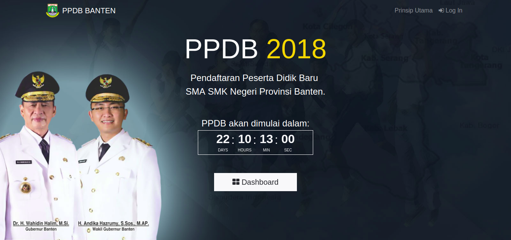](administrator/psb-umum_halaman-utama.png)

Disaat membuka aplikasi PSB untuk admin maka akan muncul tombol **Dashboard**. Disebelah kanan atas terdapat tombol **prinsip utama** dan **login** yang dapat digunakan jika sudah memiliki akun. Tombol prinsip utama akan mengarahkan ke layer asas PPDB dan juga informasi singkat mengenai PPDB.

Berikut ini adalah tampilan layer mengenai informasi singkat dan asas PPDB pada halaman utama:

 

 [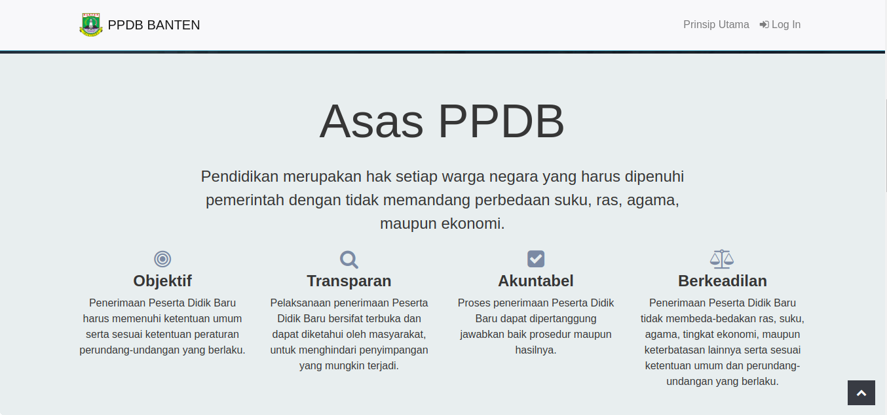](administrator/psb-umum_asas-ppdb.png)

### Tampilan Login admin

[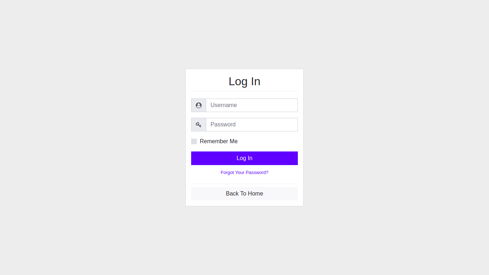](administrator/psb-umum_halaman-login-admin.png)

Di halaman ini akan muncul menu login. Disini hanya terdapat 2 **field** yng harus diisi, yaitu : Username dan juga password yang telah dimiliki. Jika admin ingin kembali ke halaman utama maka admin dapat menekan tombol **back to home** yang akan mengarahkan ke halaman utama.

### Tampilan Dashboard Admin

[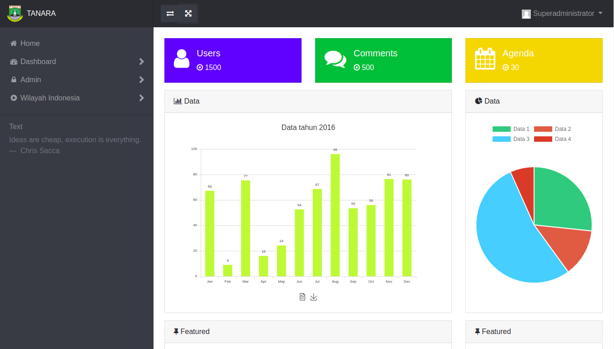](administrator/psb-umum_halaman-dashboard-utama.png)

Didalam page ini terdapat beberapa list menu yang dapat diolah oleh admin yang akan terintegrasi dengan aplikasi PPDB. Didalam aplikasi admin juga dapat melihat berapa jumlah user yang terdaftar pada aplikasi PPDB dan beberapa data utama dalam bentuk chart grafik dan pie.

#### Tampilan Menu Pendaftaran 

Didalam **menu** ini terdapat modul pendaftaran, yang didalamnya terdapat data pendaftaran yang telah diinput oleh siswa. Di menu ini admin dapat melakukan verifikasi pada siswa yang telah mendaftar pada sekolah yang dituju, untuk melakukan verifikasi admin dapat menekan tombol show pada data pendaftaran yang telah ada. Pada menu ini admin dapat mengolah data yang telah ada seperti menambahkan, melihat, mengedit, dan juga menghapus data pendaftaran yang telah ada.

Berikut ini merupakan tampilan **Add** Pendaftaran:

 

Di menu ini admin dapat menambahkan data pendaftaran yaitu: Sekolah Tujuan dan Kegiatan.

Berikut ini merupakan tampilan **Show** Pendaftaran:

 

Di menu ini admin dapat melihat data pendaftaran yang telah dibuat. Pada menu ini admin dapat melihat status pendaftaran siswa yang telah mendaftar dan melakukan verifikasi terhadap siswa tersebut. Berikut ini merupakan contoh pendaftaran siswa yang belum di verifikasi oleh admin, terlihat dari status pendaftaran siswa dan **history** yang tertera di bagian bawah masih Propose (Pengajuan). 

 

Sebelum melakukan verifikasi admin harus menginput nilai Prestasi (Dilakukan hanya jika siswa mendaftar jalur prestasi), Nilai SKTM, dan Nilai Zona. Jika Semua nilai sudah diinput maka admin dapat melakukan verifikasi pada siswa tersebut dengan menekan tombol verifikasi dan menuliskan keterangan verifikasi pada kolom yang tersedia.

 

Jika Admin telah melakukan verifikasi, maka status pendaftaran akan berubah menjadi **Verifikasi** yang akan terlihat di status pendaftaran dan history-nya. Dan Nilai yang telah diinput akan tampil di halaman Pendaftaran Siswa. Berikut merupakan contoh gambar pendaftaran yang telah di verifikasi oleh admin:

 

Berikut ini merupakan tampilan **Edit** Pendaftaran:

Di menu ini admin dapat merubah data pendaftaran jika dirasa masih ada kesalahan.

#### Tampilan Menu Seleksi 

Didalam **menu** ini terdapat modul seleksi. Pada menu ini terdapat data hasil seleksi siswa yang telah melakukan pendaftaran. Pada menu ini admin dapat menambahkan, melihat, mengedit, dan juga menghapus data seleksi yang telah ada.

Berikut ini merupakan tampilan **Add** Seleksi:

Di menu ini admin dapat menambahkan data seleksi yaitu: Pendaftaran, Siswa, dan Nilai.

Berikut ini merupakan tampilan **Show** Seleksi:

Di menu ini admin dapat melihat data seleksi yang telah dibuat.

Berikut ini merupakan tampilan **Edit** Seleksi:

Di menu ini admin dapat merubah data seleksi jika dirasa masih ada kesalahan.

#### Tampilan Menu Data Akademik 

[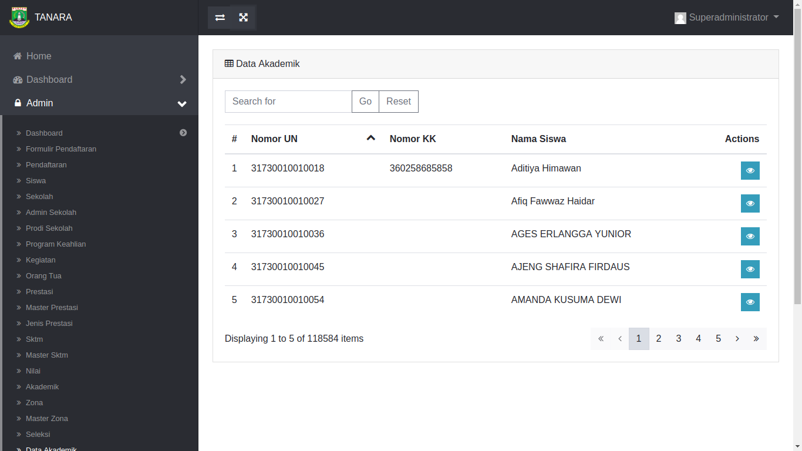](administrator/psb-umum_menu-data-akademik-admin.png)

Didalam **menu** ini terdapat data identitas seluruh siswa yang nantinya akan dijadikan acuan pada saat proses pendaftaran. Siswa yang yang akan melakukan pendaftaran ke SMA dan SMK datanya akan dibandingkan dengan data yang ada di sini. Jika data siswa tidak ada di data akademik, maka siswa tidak dapat melakukan pendaftaran ke situs PPDB Online. Jika siswa telah melakukan pendaftaran maka akan ditandai dengan terisinya nomor Kartu keluarga pada data akademik yang dapat dilihat di index menu, jika siswa belum melakukan pendaftaran maka nomor Kartu keluarga akan terlihat kosong. Pada menu ini admin dapat melihat data identitas lengkap dari siswa tersebut. Pada menu ini admin tidak memiliki akses untuk menambahkan dan mengedit data, dan hanya dapat melihat data akademik yang telah ada.

Berikut ini merupakan tampilan **Show** Data Akademik:

[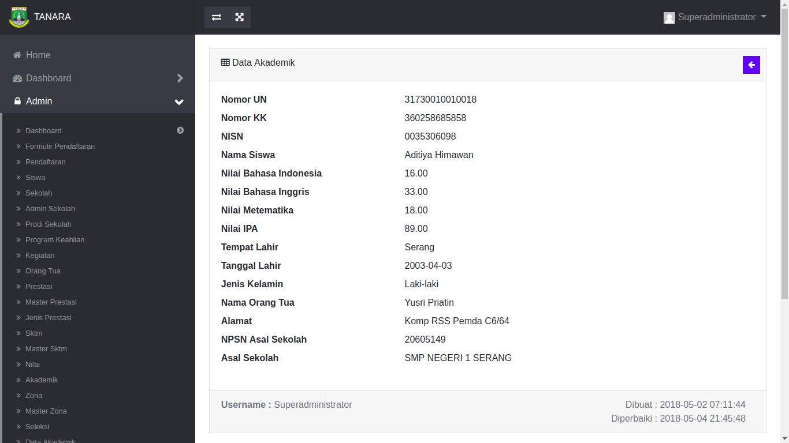](administrator/psb-umum_menu-show-data-akademik-admin.png)

Di menu ini admin dapat melihat data Data Akademik yang telah ada.

#### Tampilan Menu Siswa 

Didalam **menu** ini terdapat data identitas siswa yang telah melakukan pendaftaran. Pada menu ini admin dapat melihat data identitas lengkap dari siswa tersebut. Pada menu ini admin dapat menambahkan, melihat, mengedit, dan juga menghapus data siswa yang telah ada.

Berikut ini merupakan tampilan **Add** Siswa:

Di menu ini admin dapat menambahkan data siswa yaitu: Nomor UN, NIK, Nama Siswa, No KK, Alamat KK, Tempat Lahir, Tanggal Lahir, Jenis Kelamin, Agama, NISN, Tahun Lulus, Sekolah Tujuan, Prodi Sekolah, Provinsi, Kabupaten/Kota, Kecamatan, dan Kelurahan/Desa. 

Berikut ini merupakan tampilan **Show** Siswa:

Di menu ini admin dapat melihat data siswa yang telah dibuat.

Berikut ini merupakan tampilan **Edit** Siswa:

Di menu ini admin dapat merubah data siswa jika dirasa masih ada kesalahan.

#### Tampilan Menu Sekolah 

Didalam **menu** ini terdapat data sekolah SMA dan SMK negri yang terdapat di seluruh wilayah Provinsi Banten. Pada menu ini admin dapat melihat data sekolah SMA dan SMK negri yang terdapat di Banten. Pada menu ini admin dapat menambahkan, melihat, mengedit, dan juga menghapus data sekolah yang telah ada.

Berikut ini merupakan tampilan **Add** Sekolah:

Di menu ini admin dapat menambahkan data sekolah yaitu: Nama Sekolah, NPSN, Jenis Sekolah, Alamat, Provinsi, Kabupaten/Kota, Kecamatan, Kelurahan/Desa, Nomor Telepon, Email, dan Zona.

Berikut ini merupakan tampilan **Show** Sekolah:

Di menu ini admin dapat melihat data sekolah yang telah dibuat.

Berikut ini merupakan tampilan **Edit** Sekolah:

Di menu ini admin dapat merubah data sekolah jika dirasa masih ada kesalahan.

#### Tampilan Menu Admin Sekolah 

[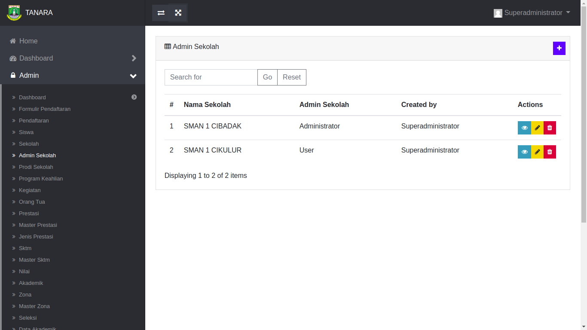](administrator/psb-umum_menu-admin-sekolah-admin.png)

Didalam **menu** ini terdapat data Admin Sekolah SMA dan SMK negri yang terdapat di seluruh wilayah Provinsi Banten. Pada menu ini admin dapat melihat data Admin Sekolah SMA dan SMK negri yang terdapat di Banten. Admin Sekolah berfungsi untuk mengurus adminsitrasi pendaftaran siswa pada masing-masing sekolah, mulai dari pendaftaran, input nilai prestasi, zona, sktm, sampai proses seleksi. Pada menu ini administrator dapat menambahkan, melihat, mengedit, dan juga menghapus data Admin Sekolah yang telah ada.

Berikut ini merupakan tampilan **Add** Admin Sekolah:

[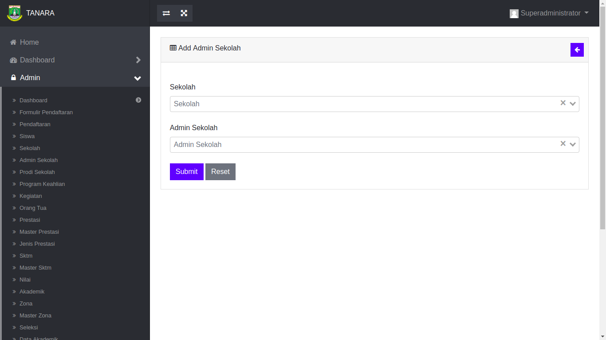](administrator/psb-umum_menu-add-admin-sekolah-admin.png)

Di menu ini admin dapat menambahkan data Admin Sekolah yaitu: Sekolah, dan Admin Sekolah. Untuk menambahkan admin sekolah administrator harus menambahkan **User** baru terlebih dahulu di menu User dan mengubah rolenya menjadi **Admin Sekolah**. Jika sudah ditambahkan user baru maka administrator dapat menambah admin sekolah dengan cara memilih sekolah yang diinginkan pada field Sekolah dan menambahkan admin yang sudah dibuat di menu User.

Berikut ini merupakan tampilan **Show** Admin Sekolah:

[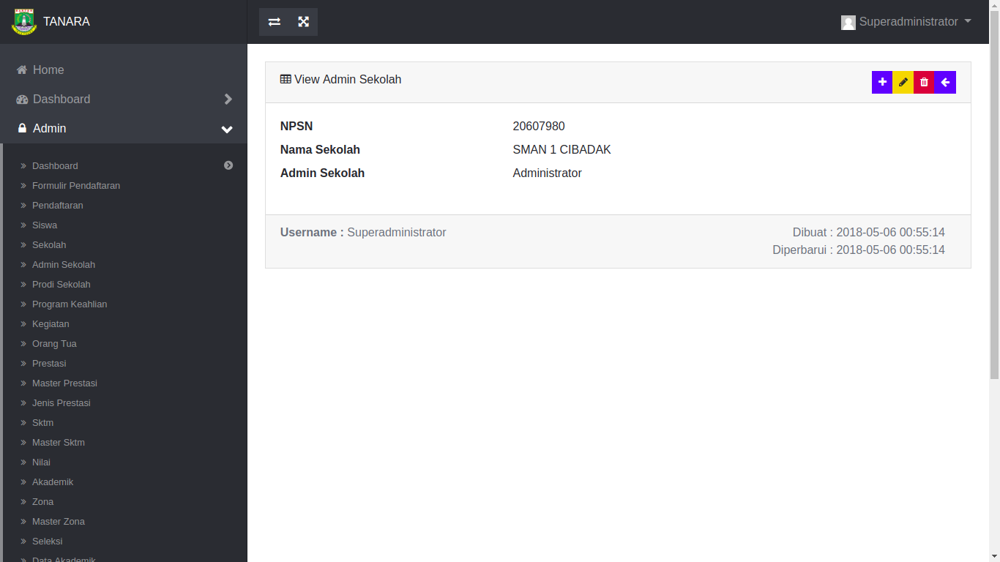](administrator/psb-umum_menu-show-admin-sekolah-admin.png)

Di menu ini admin dapat melihat data Admin Sekolah yang telah dibuat.

Berikut ini merupakan tampilan **Edit** Admin Sekolah:

[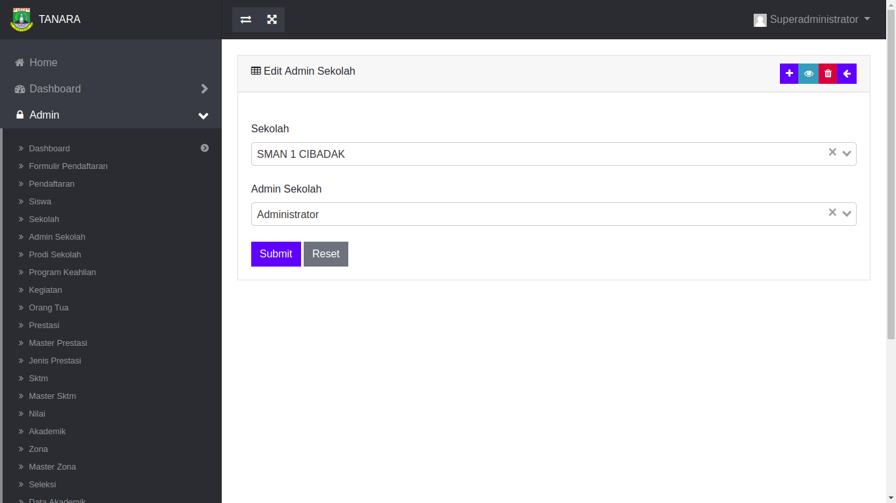](administrator/psb-umum_menu-edit-admin-sekolah-admin.png)

Di menu ini admin dapat merubah data sekolah jika dirasa masih ada kesalahan.

#### Tampilan Menu Prodi Sekolah 

Didalam **menu** ini terdapat data prodi sekolah SMA dan SMK negri yang terdapat di seluruh wilayah Provinsi Banten. Pada menu ini admin dapat melihat data prodi sekolah, program keahlian dan juga kuota siswa pada setiap sekolah SMA dan SMK negri yang terdapat di Banten. Pada menu ini admin dapat menambahkan, melihat, mengedit, dan juga menghapus data prodi sekolah yang telah ada.

Berikut ini merupakan tampilan **Add** Prodi Sekolah:

Di menu ini admin dapat menambahkan data prodi sekolah yaitu: Nama Sekolah, Program Keahlian, dan Kuota Siswa.

Berikut ini merupakan tampilan **Show** Prodi Sekolah:

Di menu ini admin dapat melihat data prodi sekolah yang telah dibuat.

Berikut ini merupakan tampilan **Edit** Prodi Sekolah:

Di menu ini admin dapat merubah data prodi sekolah jika dirasa masih ada kesalahan.

#### Tampilan Menu Program keahlian

Didalam **menu** ini terdapat data program keahlian yang ditawarkan oleh sekolah SMA dan SMK negri yang terdapat di seluruh wilayah Provinsi Banten. Pada menu ini admin dapat melihat data program keahlian yang terdapat di sekolah SMA dan SMK negri yang terdapat di Banten. Pada menu ini admin dapat menambahkan, melihat, mengedit, dan juga menghapus data sekolah yang telah ada.

Berikut ini merupakan tampilan **Add** Program Keahlian:

Di menu ini admin dapat menambahkan data program keahlian yaitu: Label dan Keterangan.

Berikut ini merupakan tampilan **Show** Program Keahlian:

Di menu ini admin dapat melihat data program keahlian yang telah dibuat.

Berikut ini merupakan tampilan **Edit** Program Keahlian:

Di menu ini admin dapat merubah data program keahlian jika dirasa masih ada kesalahan.

#### Tampilan Menu Kegiatan 

Didalam **menu** ini terdapat data kegiatan mengenai proses pendaftaran dan seleksi calon siswa baru yang akan mendaftar ke sekolah SMA dan SMK negri yang terdapat di seluruh wilayah Provinsi Banten. Pada menu ini admin dapat melihat data pendaftaran maupun tanggal dilaksanakannya proses kegiatan dan seleksi penerimaan peserta didik baru. Pada menu ini admin dapat menambahkan, melihat, mengedit, dan juga menghapus data kegiatan yang telah ada.

Berikut ini merupakan tampilan **Add** Kegiatan:

Di menu ini admin dapat menambahkan data kegiatan yaitu: Label, Description, Tanggal Mulai, dan Tanggal Selesai.

Berikut ini merupakan tampilan **Show** Kegiatan:

Di menu ini admin dapat melihat data kegiatan yang telah dibuat.

Berikut ini merupakan tampilan **Edit** Kegiatan:

Di menu ini admin dapat merubah data kegiatan jika dirasa masih ada kesalahan.

#### Tampilan Menu Orang Tua 

Didalam **menu** ini terdapat data orang tua dari siswa yang telah melakukan registrasi. Pada menu ini admin dapat melihat data lengkap orang tua siswa yang telah melakukan registrasi. Didalam menu ini admin dapat melihat data orang tua baik alamatnya, pekerjaan, pendidikan, dan data penunjang lainnya. Pada menu ini admin dapat menambahkan, melihat, mengedit, dan juga menghapus data orang tua yang telah ada.

Berikut ini merupakan tampilan **Add** Orang Tua:

Di menu ini admin dapat menambahkan data orang tua yaitu: Nama Siswa, Nomor Telepon, Nama Ayah, Nama Ibu, Pendidikan Ayah, Pekerjaan Ayah, Pendidikan Ibu, Pekerjaan Ibu, Alamat Orang Tua.

Berikut ini merupakan tampilan **Show** Orang Tua:

Di menu ini admin dapat melihat data orang tua yang telah dibuat.

Berikut ini merupakan tampilan **Edit** Orang Tua:

Di menu ini admin dapat merubah data orang tua jika dirasa masih ada kesalahan.

#### Tampilan Menu Prestasi 

Didalam **menu** ini terdapat data prestasi siswa dari lomba yang telah diikutinya. Setiap lomba memiliki nilai yang berbeda-beda dan akan di kalkulasikan ke dalam menu **nilai**. Pada menu ini admin dapat melihat daftar siswa yang memiliki prestasi dan lomba yang diikutinya beserta tingkat dan juaranya. Pada menu ini admin dapat menambahkan, melihat, mengedit, dan juga menghapus data prestasi siswa yang telah ada.

Berikut ini merupakan tampilan **Add** Prestasi:

Di menu ini admin dapat menambahkan data prestasi yaitu: Nama Siswa, Master Prestasi, dan Nama Lomba.

Berikut ini merupakan tampilan **Show** Prestasi:

Di menu ini admin dapat melihat data prestasi yang telah dibuat.

Berikut ini merupakan tampilan **Edit** Prestasi:

Di menu ini admin dapat merubah data prestasi jika dirasa masih ada kesalahan.

#### Tampilan Menu Master Prestasi

Didalam **menu** ini terdapat data mengenai prestasi, juara, tingkat, dan jumlah nilai yang didapatkan dari prestasi tersebut. Pada menu ini admin dapat melihat daftar data juara dari mulai tingkat kabupaten sampai tingkat internasional. Pada menu ini admin dapat menambahkan, melihat, mengedit, dan juga menghapus data prestasi yang telah ada.

Berikut ini merupakan tampilan **Add** Master Prestasi:

Di menu ini admin dapat menambahkan data master prestasi yaitu: Jenis Prestasi, Juara, Tingkat, Nilai, dan Kode prestasi.

Berikut ini merupakan tampilan **Show** Master Prestasi:

Di menu ini admin dapat melihat data master prestasi yang telah dibuat.

Berikut ini merupakan tampilan **Edit** Master Prestasi:

Di menu ini admin dapat merubah data master prestasi jika dirasa masih ada kesalahan.

#### Tampilan Menu Jenis Prestasi 

Didalam **menu** ini terdapat daftar data jenis prestasi. Pada menu ini admin dapat melihat daftar jenis prestasi yang tersedia, mulai dari kejuaaraan yang diselenggarakan oleh Kemendikbud sampai kejuaraan yang diselenggarakan oleh Kemenag. Pada menu ini admin dapat menambahkan, melihat, mengedit, dan juga menghapus data jeni prestasi yang telah ada.

Berikut ini merupakan tampilan **Add** Jenis Prestasi:

Di menu ini admin dapat menambahkan data jenis prestasi yaitu: Nama Jenis Prestasi.

Berikut ini merupakan tampilan **Show** Jenis Prestasi:

Di menu ini admin dapat melihat data jenis prestasi yang telah dibuat.

Berikut ini merupakan tampilan **Edit** Jenis Prestasi:

Di menu ini admin dapat merubah data jenis prestasi jika dirasa masih ada kesalahan.

#### Tampilan Menu SKTM 

Didalam **menu** ini terdapat data mengenai siswa yang memiliki surat keterangan tidak mampu **SKTM**. Siswa yang memiliki SKTM akan mendapatkan nomor SKTM dan juga nilai yang nantinya akan dikalkulasikan ke menu **nilai**. Pada menu ini admin dapat melihat daftar siswa yang memiliki SKTM beserta jenisnya. Pada menu ini admin dapat menambahkan, melihat, mengedit, dan juga menghapus data siswa pemegang SKTM yang telah ada.

Berikut ini merupakan tampilan **Add** SKTM:

Di menu ini admin dapat menambahkan data SKTM yaitu: Nama Siswa, Kriteria SKTM, dan No SKTM.

Berikut ini merupakan tampilan **Show** SKTM:

Di menu ini admin dapat melihat data SKTM yang telah dibuat.

Berikut ini merupakan tampilan **Edit** SKTM:

[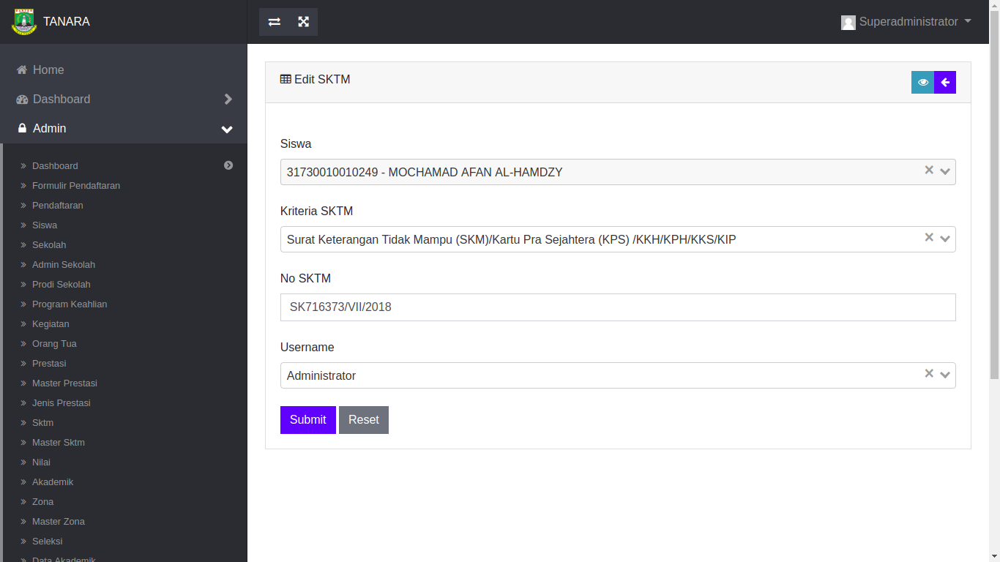](administrator/psb-umum_menu-edit-sktm-admin.png)

Di menu ini admin dapat merubah data SKTM jika dirasa masih ada kesalahan.

#### Tampilan Menu Master SKTM 

Didalam **menu** ini terdapat daftar data SKTM yang ada. Di menu ini terdapat data jenis SKTM yang tersedia yang dapat dipilih oleh siswa. Pada menu ini admin dapat menambahkan, melihat, mengedit, dan juga menghapus data Master SKTM yang telah ada

Berikut ini merupakan tampilan **Add** Master SKTM:

Di menu ini admin dapat menambahkan data master SKTM yaitu: Kriteria, Instansi, dan Nilai.

Berikut ini merupakan tampilan **Show** Master SKTM:

Di menu ini admin dapat melihat data master SKTM yang telah dibuat.

Berikut ini merupakan tampilan **Edit** Master SKTM:

Di menu ini admin dapat merubah data master SKTM jika dirasa masih ada kesalahan.

#### Tampilan Menu Nilai 

Didalam **menu** ini terdapat daftar data nilai siswa yang ada. Di menu ini nilai siswa di dapatkan dari kalkulasi beberapa data yang ada seperti: akademik, SKTM, Prestasi, dan juga zona. Di menu ini admin dapat mengetahui berapa total nilai dan bobot yang didapatkan oleh siswa. Pada menu ini admin dapat menambahkan, melihat, mengedit, dan juga menghapus data nilai siswa yang telah ada.

Berikut ini merupakan tampilan **Add** Nilai:

Di menu ini admin dapat menambahkan data nilai yaitu: Nama Siswa, Bobot, Akademik, Prestasi, Zona, dan SKTM.

Berikut ini merupakan tampilan **Show** Nilai:

Di menu ini admin dapat melihat data nilai yang telah dibuat.

Berikut ini merupakan tampilan **Edit** Nilai:

Di menu ini admin dapat merubah data nilai jika dirasa masih ada kesalahan.

#### Tampilan Menu Akademik 

Didalam **menu** ini terdapat daftar data nilai siswa yang diperoleh dari hasil UN. Di menu ini nilai Un siswa akan dikalkulasikan ke menu **nilai**, yang nantinya akan akan diolah dengan hasil nilai lainnya  yang di dapatkan dari kalkulasi beberapa data yang ada seperti: SKTM, Prestasi, dan juga zona. Di menu ini admin dapat mengetahui berapa nilai UN yang didapat oleh siswa sperti nilai : Bhs. Indonesia, Bhs. Inggris, Matematika, dan juga IPA. Pada menu ini admin dapat menambahkan, melihat, mengedit, dan juga menghapus data nilai UN siswa yang telah ada.

Berikut ini merupakan tampilan **Add** Akademik:

Di menu ini admin dapat menambahkan data akademik yaitu: Nama Siswa, Bahasa Indonesia, Bahasa Inggris, Matematika, dan IPA.

Berikut ini merupakan tampilan **Show** Akademik:

Di menu ini admin dapat melihat data akademik yang telah dibuat.

Berikut ini merupakan tampilan **Edit** Akademik:

Di menu ini admin dapat merubah data akademik jika dirasa masih ada kesalahan.

#### Tampilan Menu Zona 

[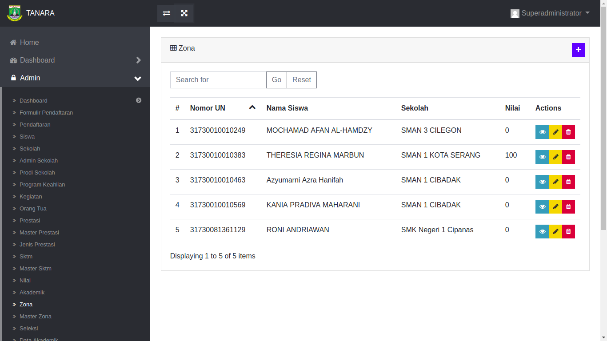](administrator/psb-umum_menu-zona-admin.png)

Didalam **menu** ini terdapat data zona siswa dan zona sekolah yang dipilih oleh siswa ketika melakukan pendaftaran. Pada menu ini ketika admin menginput nama siswa maka zona siswa tersebut dan zona sekolah yang dipilihnya akan dibandingkan untuk mendapatkan nilai zona. Didalam menu ini zona siswa dan juga sekolah mempengaruhi nilai zona tersebut, yang nantinya akan dikalkulasikan ke dalam menu nilai. Pada menu ini admin dapat menambahkan, melihat, mengedit, dan juga menghapus data zona siswa yang telah ada.

Berikut ini merupakan tampilan **Add** Zona:

Di menu ini admin dapat menambahkan data zona yaitu: Nama Siswa. Wilayah Zonasi otomatis ter-input ketika admin menambahkan Nama Siswa.

Berikut ini merupakan tampilan **Show** Zona:

[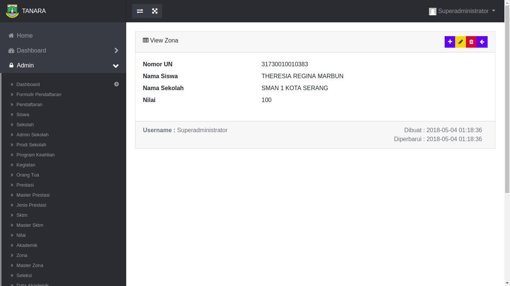](administrator/psb-umum_menu-show-zona-admin.png)

Di menu ini admin dapat melihat data zona yang telah dibuat.

Berikut ini merupakan tampilan **Edit** Zona:

Di menu ini admin dapat merubah data zona jika dirasa masih ada kesalahan.

#### Tampilan Menu Master Zona 

Didalam **menu** ini terdapat data zona dari setiap wilayah yang ada di seluruh Provinsi Banten. Pada menu ini admin dapat melihat kode zona dari setiap kabupaten dan kota yang ada di Banten. Pada menu ini admin dapat menambahkan, melihat, mengedit, dan juga menghapus data master zona yang telah ada.

Berikut ini merupakan tampilan **Add** Master Zona:

Di menu ini admin dapat menambahkan data master zona yaitu: Tingkat, Kode, dan Label.

Berikut ini merupakan tampilan **Show** Master Zona:

Di menu ini admin dapat melihat data master zona yang telah dibuat.

Berikut ini merupakan tampilan **Edit** Master Zona:

Di menu ini admin dapat merubah data master zona jika dirasa masih ada kesalahan.

#### Tampilan Menu User 

[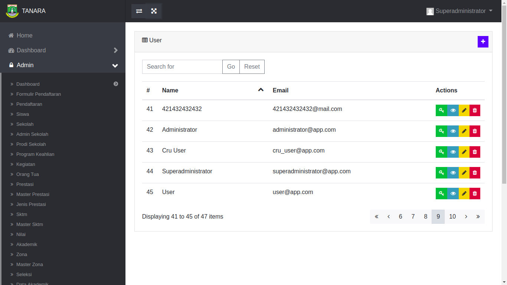](administrator/psb-umum_menu-user-admin.png)

Di dalam menu ini terdapat data user yang ada di aplikasi, baik itu Superadmin, Admin Sekolah, dan User biasa. Di dalam menu ini Administrator (Superadmin) dapat membuat user baru dan mengatur rolenya sesuai dengan yang dibutuhkan. Administrator juga mendapatkan hak untuk mengubah suatu user beserta role-nya dan juga menghapus user jika diinginkan. Ada lima role yang tersedia untuk sebuah user yaitu : Superadmin, Admin Sekolah, Administrator, User, dan Siswa. Setiap role memiliki hak akses yang berbeda-beda. 

Berikut ini merupakan tampilan **Add** User:

[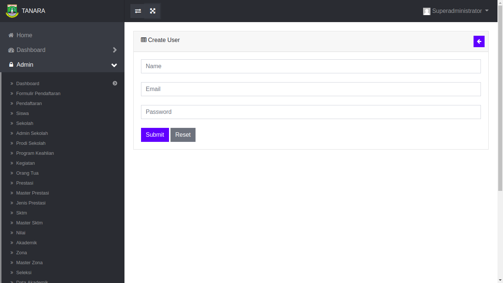](administrator/psb-umum_menu-add-user-admin.png)

Pada menu add ini admin dapat menambahkan data User yang akan di buat dan juga memilih role User-nya.

Berikut ini merupakan tampilan **Set Role** User:

[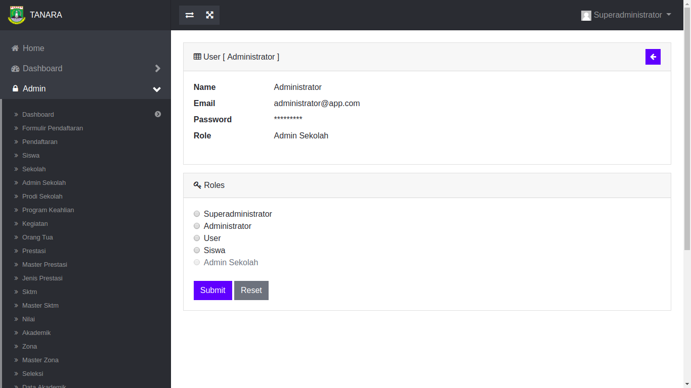](administrator/psb-umum_menu-set-role-user-admin.png)

Pada menu show ini admin dapat mengubah role pada user.

Berikut ini merupakan tampilan **Show** User:

[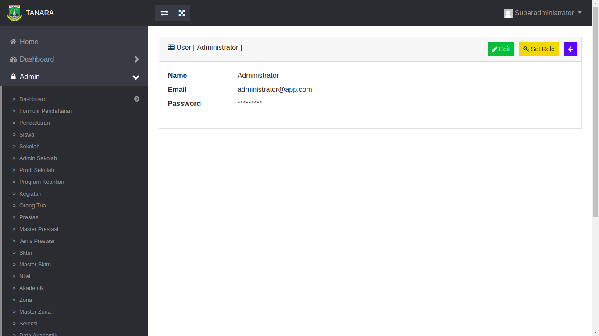](administrator/psb-umum_menu-show-user-admin.png)

Pada menu show ini admin dapat melihat data User yang telah di tambahkan. Admin juga dapat menekan tombol edit dan set role jika dirasa data perlu diubah.

Berikut ini merupakan tampilan **Edit** User:

[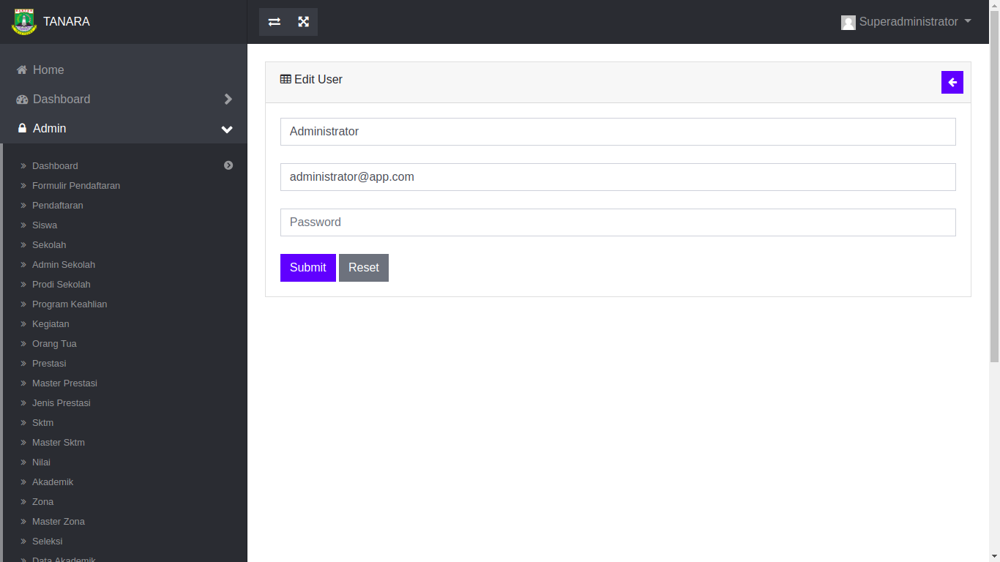](administrator/psb-umum_menu-edit-user-admin.png)

Pada menu ini admin dapat mengedit data User yang telah dibuat.

#### Tampilan Menu Workflow 

Didalam **menu** ini admin dapat menambahkan data workflow dari proses yang telah ada, baik itu proses pendaftaran maupun proses seleksi. Menu ini merupakan alur kerja dari proses yang telah ada. Pada menu ini admin dapat melihat alur apa saja yang dapat dilakukan oleh Superadmin ataupun admin, seperti: propose, review, dan juga reject. Di menu ini admin dapat menambahkan, melihat, mengedit, dan juga menghapus data workflow yang telah ada.

Berikut ini merupakan tampilan **Add** Workflow:

Pada menu add ini admin dapat menambahkan data workflow yang akan di buat dan juga memilih konten workflownya.

Berikut ini merupakan tampilan **Show** Workflow:

Pada menu show ini admin dapat melihat data workflow yang telah di tambahkan. Admin juga dapat menambahkan register workflownya seperti tipe workflow dan tipe kontennya.

Berikut ini merupakan tampilan **Edit** Workflow:

Pada menu ini admin dapat mengedit data workflow yang telah dibuat. 

Berikut ini merupakan tampilan **Menu** Workflow Transition:

Didalam **menu** ini terdapat data workflow dari proses yang telah ada, di menu ini admin dapat melakukan transisi dari data workflow yang telah ditambahkan seperti: propose to propose yaitu usulan dari workflow ini telah dibuat dan juga propose to review yaitu usulan dari workflow akan di minta review. Pada menu ini admin dapat menambahkan deskripsi yang dapat diketik manual ketika menambahkan data transition agar dapat lebih mudah dipahami. Di menu ini admin dapat menambahkan, melihat, mengedit, dan juga menghapus data workflow transition yang telah ada.

Berikut ini merupakan tampilan **Add** Workflow Transition:

Pada menu add ini admin dapat menambahkan data workflow transition yang akan di buat dan juga menuliskan deskripsi workflow transitionnya.

Berikut ini merupakan tampilan **Edit** Workflow Transition:

Pada menu ini admin dapat mengedit data workflow transition yang telah dibuat. 

Berikut ini merupakan tampilan **Menu** Workflow State:

Didalam **menu** ini terdapat status data workflow dari proses yang telah ada, di menu ini admin dapat menambahkan data status dari workflow yang telah dibuat. Jika ada perubahan data admin dapat merubahnya pada menu edit. Di menu ini admin dapat menambahkan, melihat, mengedit, dan juga menghapus data workflow state yang telah ada.

Berikut ini merupakan tampilan **Add** Workflow State:

Pada menu add ini admin dapat menambahkan data workflow state yang akan di buat dan juga menuliskan deskripsi workflow statenya.

Berikut ini merupakan tampilan **Edit** Workflow State:

Pada menu ini admin dapat mengedit data workflow state yang telah dibuat.

Berikut ini merupakan tampilan **Menu** Workflow Guard:

Didalam **menu** ini terdapat data workflow yang telah ada dan telah dilakukan transition. Pada menu ini admin dapat melakukan review ulang pada data workflow yang telah ada atau juga melakukan reject (penolakan) pada data workflow yang telah di tambahkan. Di menu ini admin dapat menambahkan, melihat, mengedit, dan juga menghapus data workflow guard yang telah ada.

Berikut ini merupakan tampilan **Add** Workflow Guard:

Pada menu add ini admin dapat menambahkan data workflow guard yang akan di buat dan juga menambah permissionnya seperti propose to review yaitu pengajuan di review ulang atau propose to reject yaitu pengajuan ditolak.

Berikut ini merupakan tampilan **Show** Workflow Guard:

Pada menu ini admin dapat melihat data workflow guard yang telah dibuat.

#### Tampilan Menu Vue Trust 

Didalam **menu** ini terdapat dua sub menu yang tersedia, yaitu role dan permission. Role berfungsi untuk memberikan role (peran) pada user yang telah ada dan memberikannya hak akses terhadap semua menu yang ada sesuai dengan tingkatnya. Hak akses paling tinggi diberikan kepada akun Superadmin. Superadmin dapat melakukan apa saja termasuk memberikan role pada admin lainnya ataupun kepada user biasa. Role yang diberikan kepada admin dan user biasa tentunya sangat berbeda, pada role admin hak akses yang dimiliki lebih banyak dibandingkan hak akses yang dimiliki user biasa.

Berikut ini merupakan tampilan **Add** Role:

Di menu ini Superadmin dapat menambahkan akun yang telah ada untuk nantinya di berikan hak akses sesuai dengan tingkatannya. Pada menu ini admin juga dapat memberikan deskripsi pada akun yang akan ditambahkan rolenya.

Berikut ini merupakan tampilan **Set Permissions** Role:

Di menu ini Superadmin dapat mengatur permission atau hak akses dari akun yang telah dibuat. Akun tersebut dapat di berikan hak akses sesuai dengan tingkatnya. Setiap akun memiliki hak akses yang berbeda, yang mana dapat ditentukan oleh Superadmin.

Berikut ini merupakan tampilan **Show** Role:

Di menu ini Superadmin dapat melihat data akun yang telah diberikan role, jika role yang diberikan ternyata salah Superadmin dapat menggantinya dengan menekan tombol set permission untuk menggantinya.

Berikut ini merupakan tampilan **Edit** Role:

Di menu ini Superadmin dapat merubah data akun yang telah ada jika dirasa masih ada yang belum sesuai. Superadmin juga dapat mengganti deskripsinya jika dibutuhkan.

Berikut ini merupakan tampilan **Add** Permission:

Di menu ini Superadmin dapat menambahkan kriteria permission yang nantinya akan digunakan. Superadmin juga dapat meunilskan deskripsi agar permission yang diberikan lebih jelas dan detail.

Berikut ini merupakan tampilan **Show** Permission:

Di menu ini Superadmin dapat melihat data permission yang telah dibuat.

Berikut ini merupakan tampilan **Edit** Permission:

Di menu ini Superadmin dapat merubah data permission yang telah ada jika dirasa masih ada yang belum sesuai. Superadmin juga dapat mengganti deskripsinya jika dibutuhkan.

### Wilayah Indonesia

Pada menu ini terdapat data seluruh Provinsi hingga desa yang ada di Negara Indonesia. Menu ini terdiri dari empat sub menu yaitu: Provinsi, Kabupaten, Kecamatan, dan Desa. Menu ini berfungsi untuk menentukan zona siswa dan juga sekolah berdasarkan kode wilayah. Zona siswa akan ditentukan dari Nomor Kartu keluarga yang dimiliki siswa dan dibandingkan dengan data wilayah yang ada di Indonesia. Sehingga ketika siswa meng-input Nomor kartu keluarga-nya maka zona siswa bisa didapatkan dari mulai asal Provinsi siswa tersebut sampai dengan asal desa siswa tersebut. Begitu juga dengan zona Sekolah dapat ditentukan dari kode wilayah sekolah tersebut dan akan dibandingkan dengan data wilayah yang ada di Indonesia.

#### Data Provinsi

Berikut ini merupakan gambar dari data provinsi yang ada di seluruh Indoensia:

[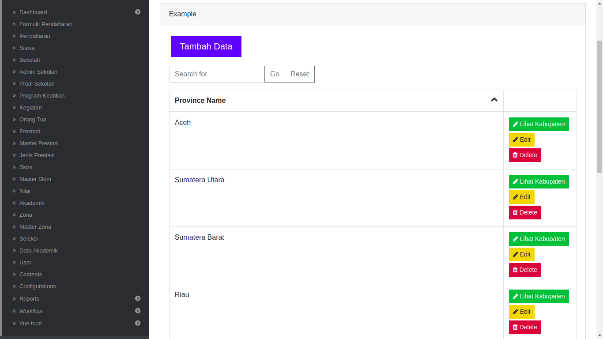](administrator/psb-umum_menu-provinsi.png)

Pada menu ini admin dapat melihat data seluruh provinsi yang ada di Indonesia, dan pada setiap provinsi yang ada admin dapat melihat data kabupaten yang terdapat pada Provinsi tersebut.

#### Data Kabupaten

Berikut ini merupakan gambar dari data kabupaten yang ada di seluruh Indonesia:

[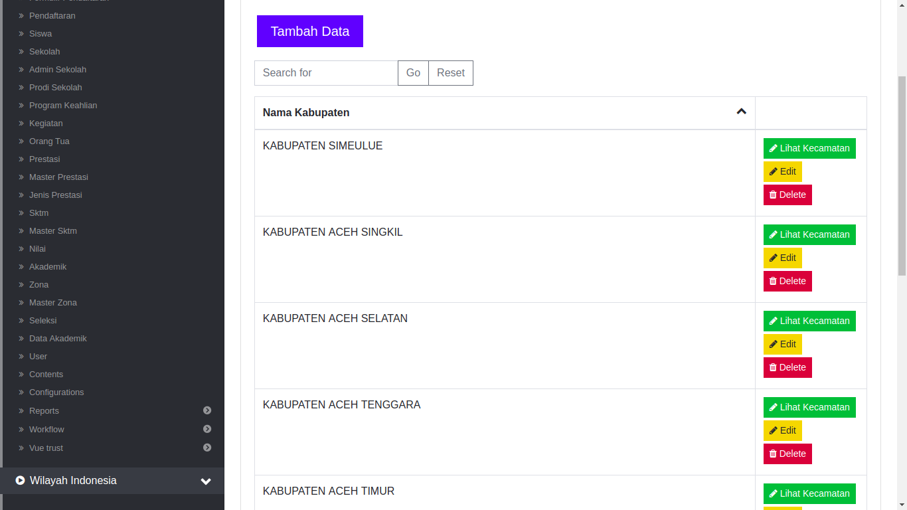](administrator/psb-umum_menu-kabupaten-admin.png)

Pada menu ini admin dapat melihat data seluruh kabupaten yang ada di Indonesia, dan pada setiap kabupaten yang ada admin dapat melihat data kecamatan yang terdapat pada Kabupaten tersebut.

#### Data Kecamatan

Berikut ini merupakan gambar dari data kecamatan yang ada di seluruh Indonesia:

[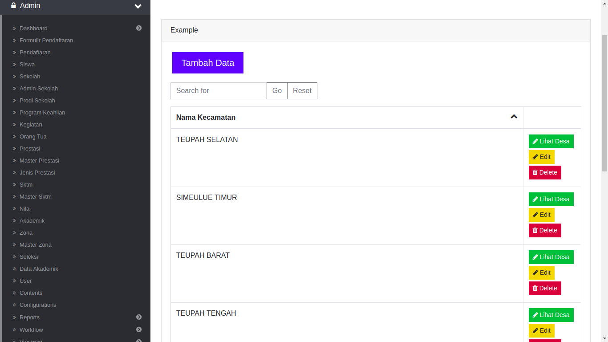](administrator/psb-umum_menu-kecamatan-admin.png)

Pada menu ini admin dapat melihat data seluruh kecamatan yang ada di Indonesia, dan pada setiap kecamatan yang ada admin dapat melihat data desa yang terdapat pada Kecamatan tersebut.

#### Data Desa

Berikut ini merupakan gambar dari data desa yang ada di seluruh Indonesia:

[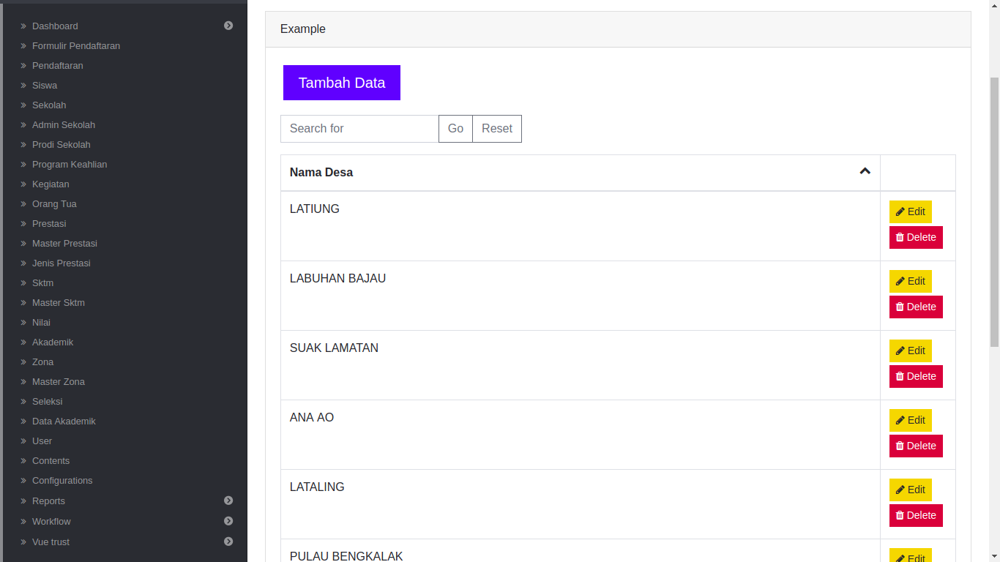](administrator/psb-umum_menu-desa-admin.png)

Pada menu ini admin dapat melihat data seluruh desa yang ada di Indonesia.