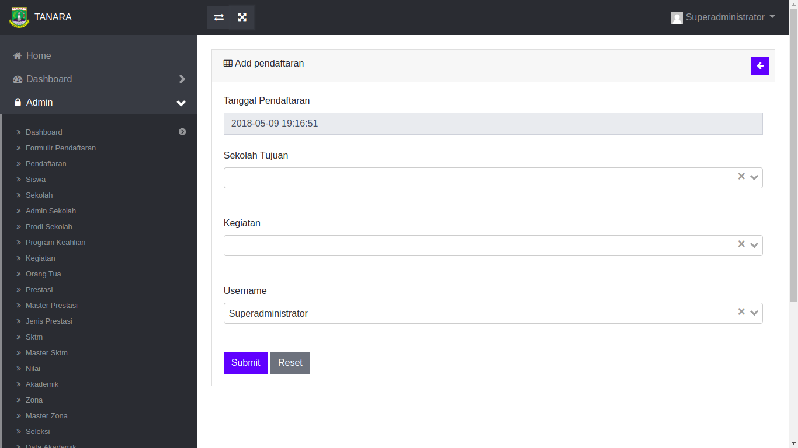
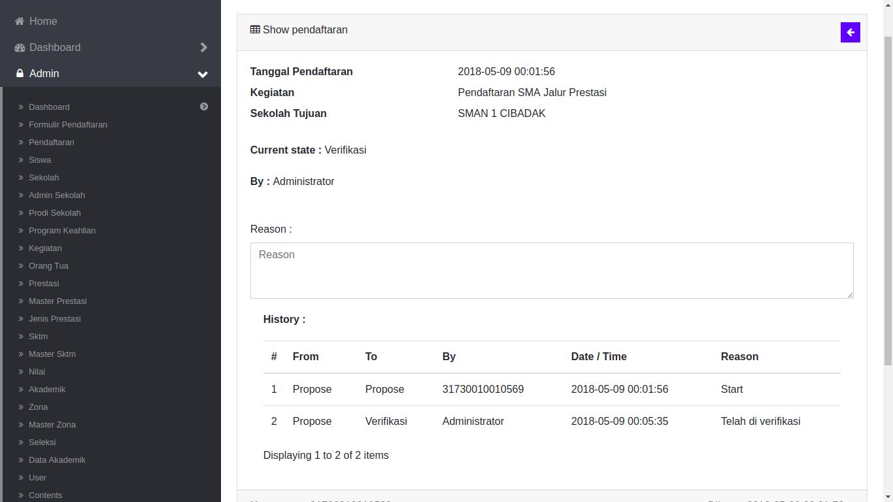
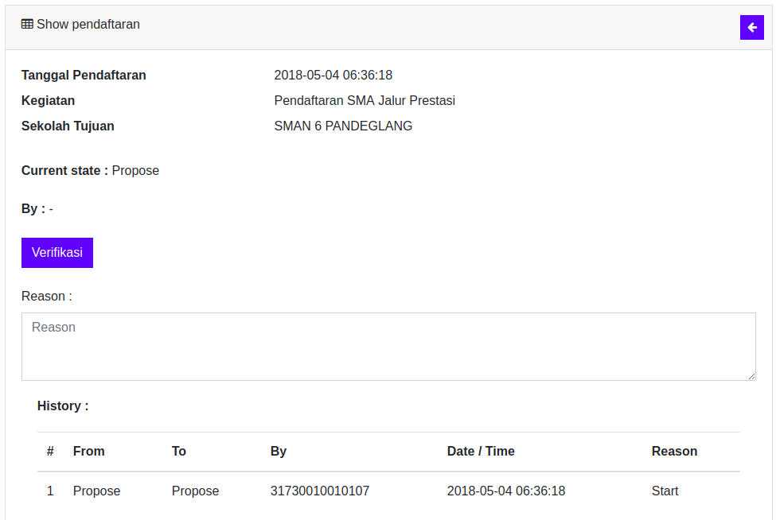
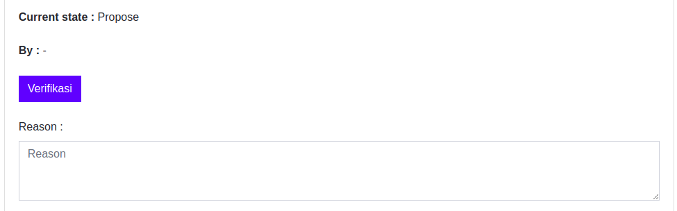
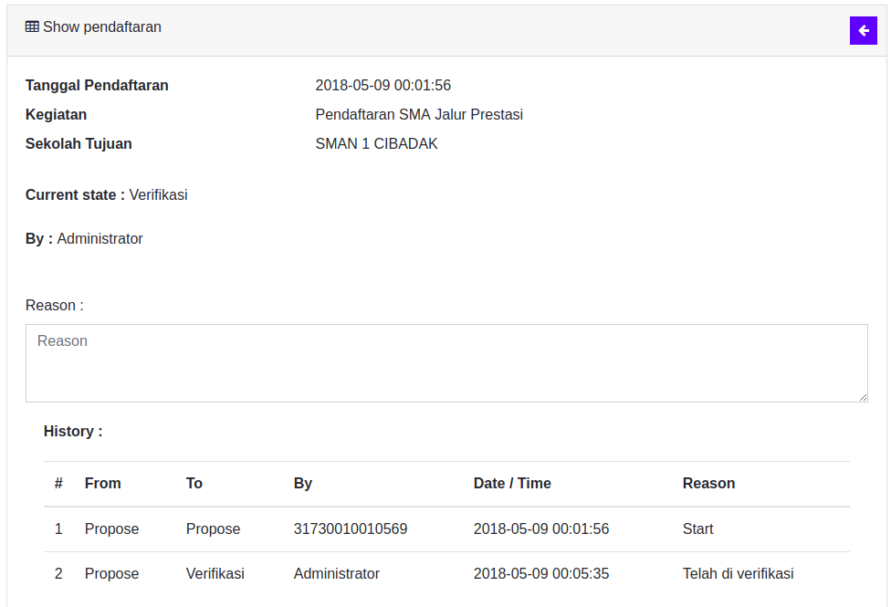
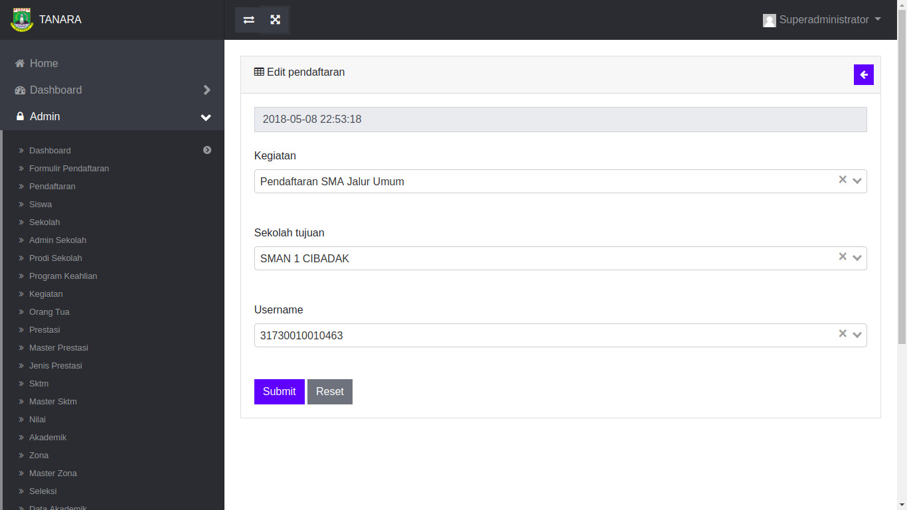
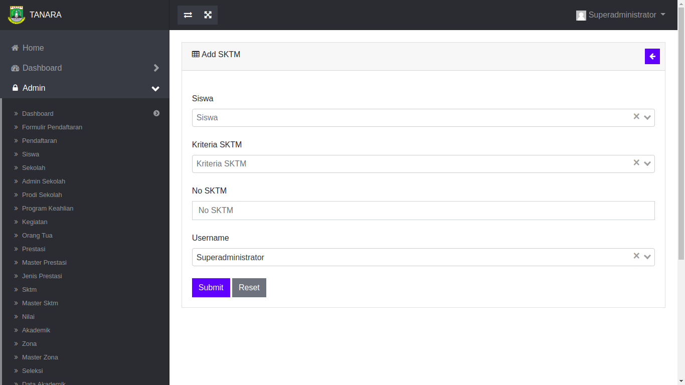
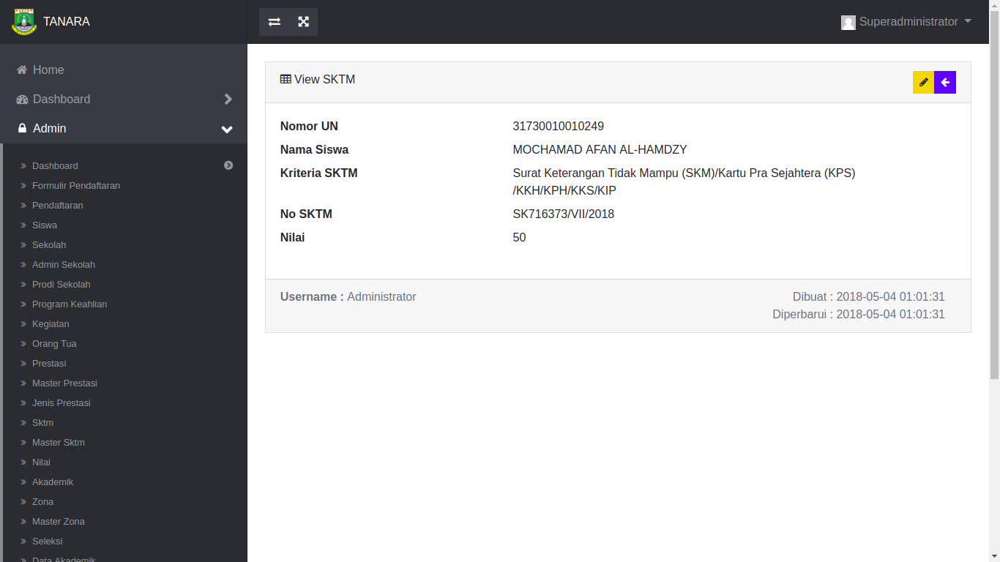
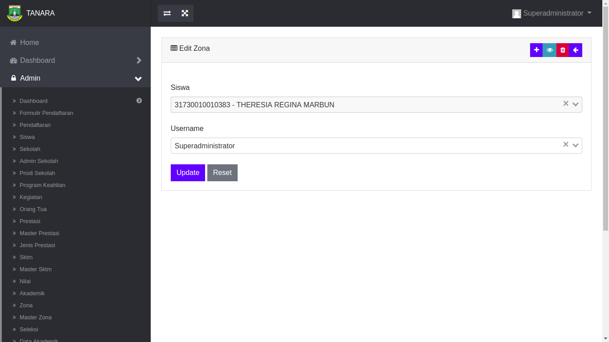

## Menu dan Cara Penggunaan Admin Sekolah

### Tampilan Halaman Utama

<!--  

Disaat membuka aplikasi PSB untuk admin maka akan muncul tombol **Dashboard**. Disebelah kanan atas terdapat tombol **prinsip utama** dan **login** yang dapat digunakan jika sudah memiliki akun. Tombol prinsip utama akan mengarahkan ke layer asas PPDB dan juga informasi singkat mengenai PPDB.

Berikut ini adalah tampilan layer mengenai informasi singkat dan asas PPDB pada halaman utama:

 

  -->

### Tampilan Login Admin Sekolah

Di halaman ini akan muncul menu login. Disini hanya terdapat 2 **field** yng harus diisi, yaitu : Username dan juga password yang telah dimiliki.

### Tampilan Dashboard Admin Sekolah

Didalam page ini terdapat beberapa list menu yang dapat diolah oleh admin yang akan terintegrasi dengan aplikasi PPDB.

### Tampilan Menu Pendaftaran Admin Sekolah

Didalam **menu** ini terdapat modul pendaftaran, yang didalamnya terdapat data pendaftaran yang telah diinput oleh siswa. Di menu ini admin dapat melakukan verifikasi pada siswa yang telah mendaftar pada sekolah yang dituju, untuk melakukan verifikasi admin dapat menekan tombol show pada data pendaftaran yang telah ada. Setiap siswa yang telah mendaftar akan terlihat statusnya pada tabel pendaftaran. Siswa yang memiliki status **terdaftar** dapat langsung diverifikasi oleh admin.

Untuk melakukan verifikasi maka admin sekolah dapat menekan tombol **Ubah** pada siswa yang memiliki status terdaftar.

Jika form sudah terbuka, maka admin mencocokkan data yang di bawa oleh siswa dan yang terdapat di dalam aplikasi, jika data yang terdapat didalam form dirasa sudah benar maka admin sekolah tinggal merubah status pendaftaran pada form menjadi **Verifikasi** lalu tekan tombol simpan.

Pada tabel pendaftaran akan terlihat status pendaftaran menjadi **Verifikasi**.

### Pendaftaran Afirmasi

Pendaftaran jalur ini merupakan jalur khusus untuk siswa yang proses pendaftarannya dilakukan oleh admin sekolah. Jalur ini meliputi siswa luar zona, siswa yang datanya tidak terdapat di data Dapodik, dan lain-lain. 

Untuk siswa yang melakukan pendaftaran di jalur ini maka siswa tidak dapat melakukan pindah sekolah dan hanya dapat melakukan sekali pendaftaran.

Berikut ini merupakan form isian yang harus diisi oleh admin sekolah:

Berikut ini merupakan form jalur afirmasi yang sudah terisi:

Jika pengisian sudah selesai maka data akan muncul pada tabel pendaftaran afirmasi:

<!-- Berikut ini merupakan tampilan **Add** Pendaftaran:

 

Di menu ini admin dapat menambahkan data pendaftaran yaitu: Sekolah Tujuan dan Kegiatan.

Berikut ini merupakan tampilan **Show** Pendaftaran:

 

Di menu ini admin dapat melihat data pendaftaran yang telah dibuat. Pada menu ini admin dapat melihat status pendaftaran siswa yang telah mendaftar dan melakukan verifikasi terhadap siswa tersebut. Berikut ini merupakan contoh pendaftaran siswa yang belum di verifikasi oleh admin, terlihat dari status pendaftaran siswa dan **history** yang tertera di bagian bawah masih Propose (Pengajuan). 

 

Sebelum melakukan verifikasi admin harus menginput nilai Prestasi (Dilakukan hanya jika siswa mendaftar jalur prestasi), Nilai SKTM, dan Nilai Zona. Jika Semua nilai sudah diinput maka admin dapat melakukan verifikasi pada siswa tersebut dengan menekan tombol verifikasi dan menuliskan keterangan verifikasi pada kolom yang tersedia.

 

Jika Admin telah melakukan verifikasi, maka status pendaftaran akan berubah menjadi **Verifikasi** yang akan terlihat di status pendaftaran dan history-nya. Dan Nilai yang telah diinput akan tampil di halaman Pendaftaran Siswa. Berikut merupakan contoh gambar pendaftaran yang telah di verifikasi oleh admin:

 

Berikut ini merupakan tampilan **Edit** Pendaftaran:

Di menu ini admin dapat merubah data pendaftaran jika dirasa masih ada kesalahan.

#### Tampilan Menu Prestasi Admin Sekolah

Didalam **menu** ini terdapat data prestasi siswa dari lomba yang telah diikutinya. Setiap lomba memiliki nilai yang berbeda-beda dan akan di kalkulasikan ke dalam menu **nilai**. Pada menu ini admin dapat melihat daftar siswa yang memiliki prestasi dan lomba yang diikutinya beserta tingkat dan juaranya. Pada menu ini admin dapat menambahkan, melihat, mengedit, dan juga menghapus data prestasi siswa yang telah ada.

Berikut ini merupakan tampilan **Add** Prestasi:

Di menu ini admin dapat menambahkan data prestasi yaitu: Nama Siswa, Master Prestasi, dan Nama Lomba.

Berikut ini merupakan tampilan **Show** Prestasi:

Di menu ini admin dapat melihat data prestasi yang telah dibuat.

Berikut ini merupakan tampilan **Edit** Prestasi:

Di menu ini admin dapat merubah data prestasi jika dirasa masih ada kesalahan.

#### Tampilan Menu SKTM Admin Sekolah

Didalam **menu** ini terdapat data mengenai siswa yang memiliki surat keterangan tidak mampu **SKTM**. Siswa yang memiliki SKTM akan mendapatkan nomor SKTM dan juga nilai yang nantinya akan dikalkulasikan ke menu **nilai**. Pada menu ini admin dapat melihat daftar siswa yang memiliki SKTM beserta jenisnya. Pada menu ini admin dapat menambahkan, melihat, mengedit, dan juga menghapus data siswa pemegang SKTM yang telah ada.

Berikut ini merupakan tampilan **Add** SKTM:

Di menu ini admin dapat menambahkan data SKTM yaitu: Nama Siswa, Kriteria SKTM, dan No SKTM.

Berikut ini merupakan tampilan **Show** SKTM:

Di menu ini admin dapat melihat data SKTM yang telah dibuat.

Berikut ini merupakan tampilan **Edit** SKTM:

Di menu ini admin dapat merubah data SKTM jika dirasa masih ada kesalahan.

#### Tampilan Menu Zona Admin Sekolah

Didalam **menu** ini terdapat data zona siswa dan zona sekolah yang dipilih oleh siswa ketika melakukan pendaftaran. Pada menu ini ketika admin menginput nama siswa maka zona siswa tersebut dan zona sekolah yang dipilihnya akan dibandingkan untuk mendapatkan nilai zona. Didalam menu ini zona siswa dan juga sekolah mempengaruhi nilai zona tersebut, yang nantinya akan dikalkulasikan ke dalam menu nilai. Pada menu ini admin dapat menambahkan, melihat, mengedit, dan juga menghapus data zona siswa yang telah ada.

Berikut ini merupakan tampilan **Add** Zona:

Di menu ini admin dapat menambahkan data zona yaitu: Nama Siswa. Wilayah Zonasi otomatis ter-input ketika admin menambahkan Nama Siswa.

Berikut ini merupakan tampilan **Show** Zona:

Di menu ini admin dapat melihat data zona yang telah dibuat.

Berikut ini merupakan tampilan **Edit** Zona:

Di menu ini admin dapat merubah data zona jika dirasa masih ada kesalahan. -->