## Menu dan Cara Penggunaan Admin Sekolah

### Tampilan Halaman Utama

<!--  

Disaat membuka aplikasi PSB untuk admin maka akan muncul tombol **Dashboard**. Disebelah kanan atas terdapat tombol **prinsip utama** dan **login** yang dapat digunakan jika sudah memiliki akun. Tombol prinsip utama akan mengarahkan ke layer asas PPDB dan juga informasi singkat mengenai PPDB.

Berikut ini adalah tampilan layer mengenai informasi singkat dan asas PPDB pada halaman utama:

 [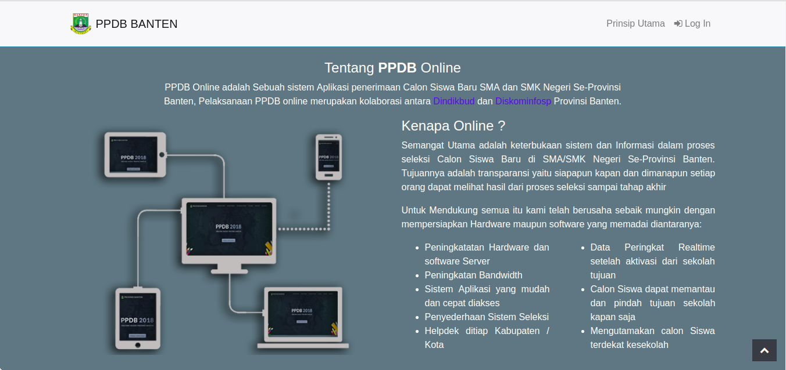](adminsekolah/psb-umum_informasi-singkat-ppdb.png)

  -->

### Tampilan Login Admin Sekolah

[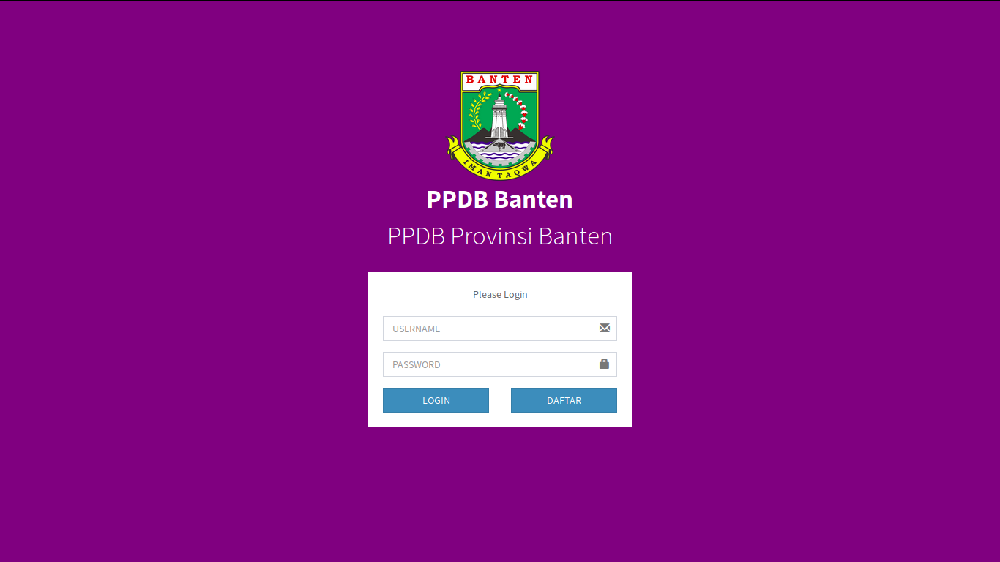](adminsekolah/psb-umum_halaman-login-admin.png)

Di halaman ini akan muncul menu login. Disini hanya terdapat 2 **field** yng harus diisi, yaitu : Username dan juga password yang telah dimiliki.

### Tampilan Dashboard Admin Sekolah

[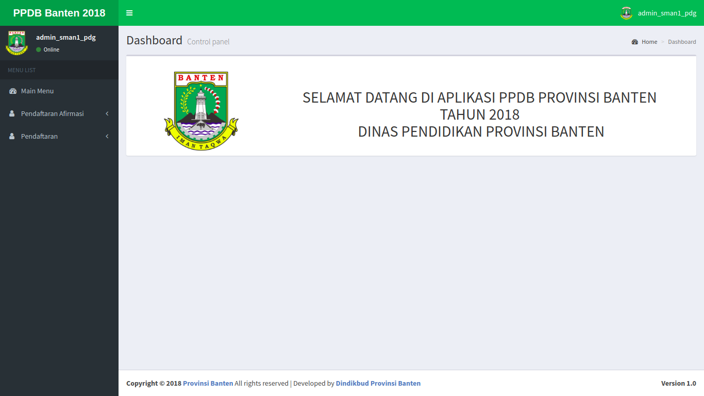](adminsekolah/psb-umum_halaman-dashboard-utama.png)

Didalam page ini terdapat beberapa list menu yang dapat diolah oleh admin yang akan terintegrasi dengan aplikasi PPDB.

### Tampilan Menu Pendaftaran Admin Sekolah

[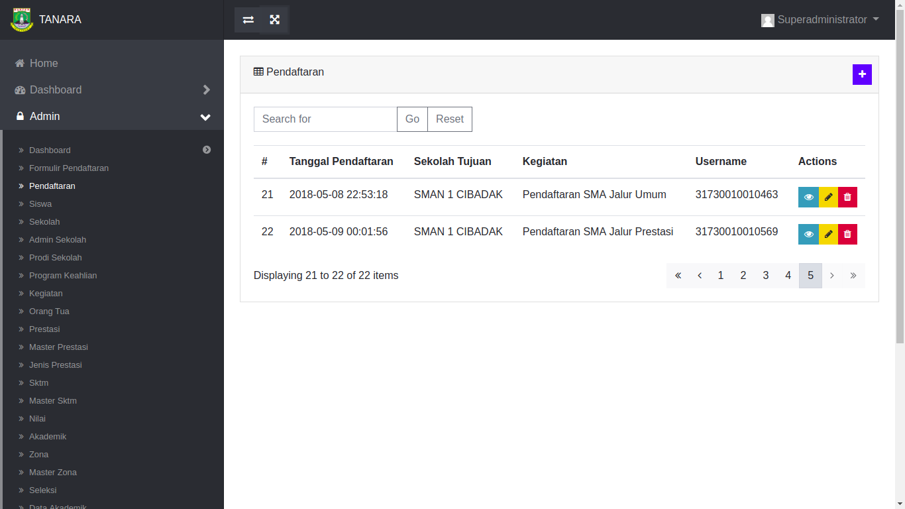](adminsekolah/psb-umum_menu-pendaftaran-admin.png)

Didalam **menu** ini terdapat modul pendaftaran, yang didalamnya terdapat data pendaftaran yang telah diinput oleh siswa. Di menu ini admin dapat melakukan verifikasi pada siswa yang telah mendaftar pada sekolah yang dituju, untuk melakukan verifikasi admin dapat menekan tombol show pada data pendaftaran yang telah ada. Setiap siswa yang telah mendaftar akan terlihat statusnya pada tabel pendaftaran. Siswa yang memiliki status **terdaftar** dapat langsung diverifikasi oleh admin.

[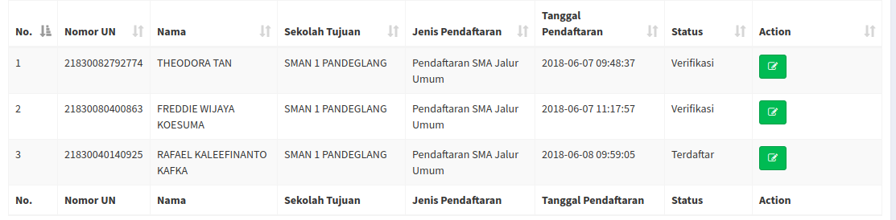](adminsekolah/psb-umum_menu-siswa-terdaftar.png)

Untuk melakukan verifikasi maka admin sekolah dapat menekan tombol **Ubah** pada siswa yang memiliki status terdaftar.

Jika form sudah terbuka, maka admin mencocokkan data yang di bawa oleh siswa dan yang terdapat di dalam aplikasi, jika data yang terdapat didalam form dirasa sudah benar maka admin sekolah tinggal merubah status pendaftaran pada form menjadi **Verifikasi** lalu tekan tombol simpan.

[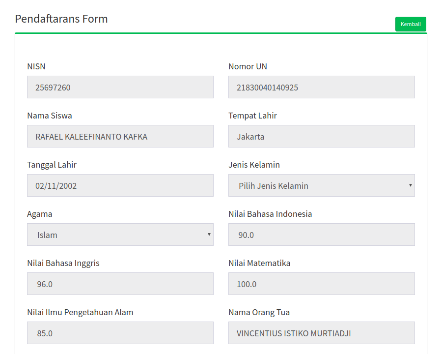](adminsekolah/psb-umum_menu-form-pendaftaran-1.png)
[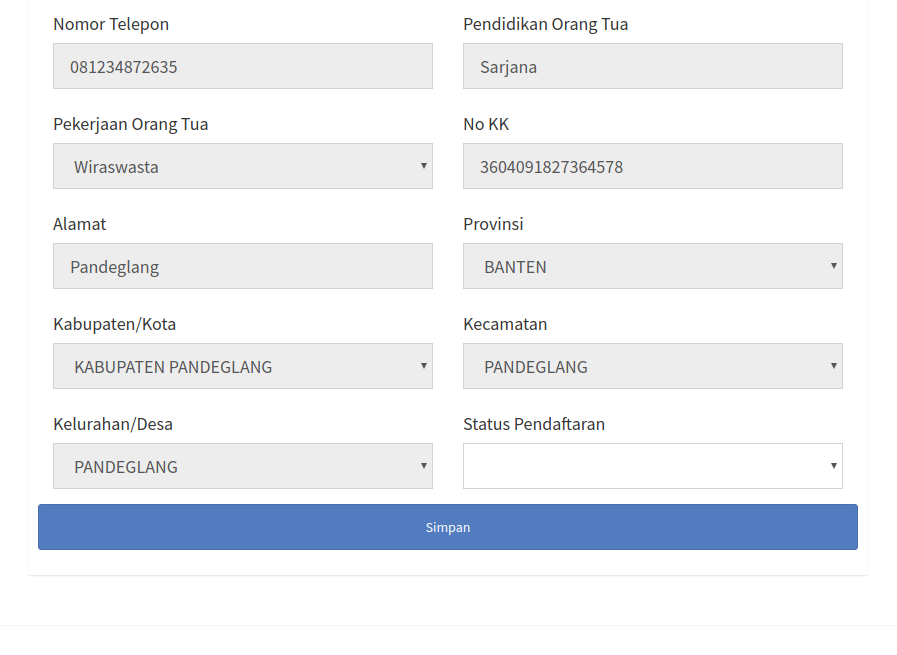](adminsekolah/psb-umum_menu-form-pendaftaran-2.png)

Pada tabel pendaftaran akan terlihat status pendaftaran menjadi **Verifikasi**.

[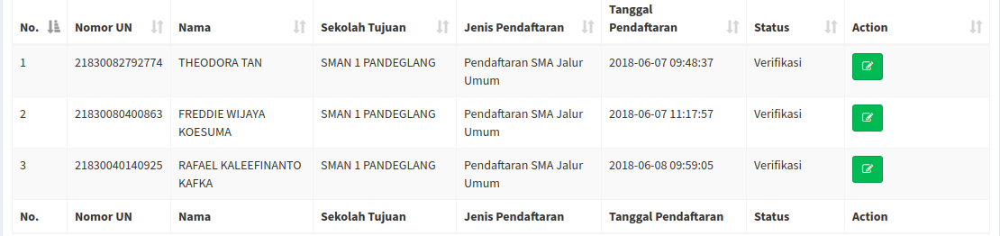](adminsekolah/psb-umum_menu-status-pendaftaran-menjadi-verifikasi.png)

### Pendaftaran Afirmasi

[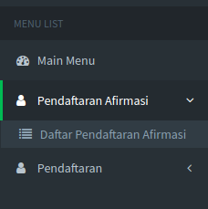](adminsekolah/psb-umum_menu-afirmasi.png)

Pendaftaran jalur ini merupakan jalur khusus untuk siswa yang proses pendaftarannya dilakukan oleh admin sekolah. Jalur ini meliputi siswa luar zona, siswa yang datanya tidak terdapat di data Dapodik, dan lain-lain. 

Untuk siswa yang melakukan pendaftaran di jalur ini maka siswa tidak dapat melakukan pindah sekolah dan hanya dapat melakukan sekali pendaftaran.

Berikut ini merupakan form isian yang harus diisi oleh admin sekolah:

[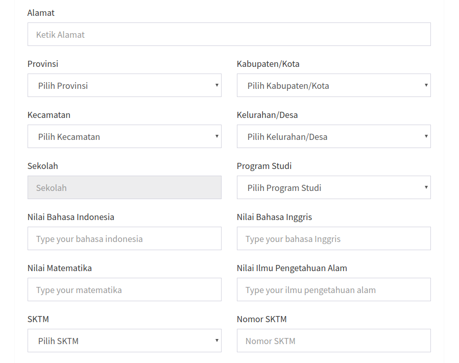](adminsekolah/psb-umum_menu-form-afirmasi2.png)
[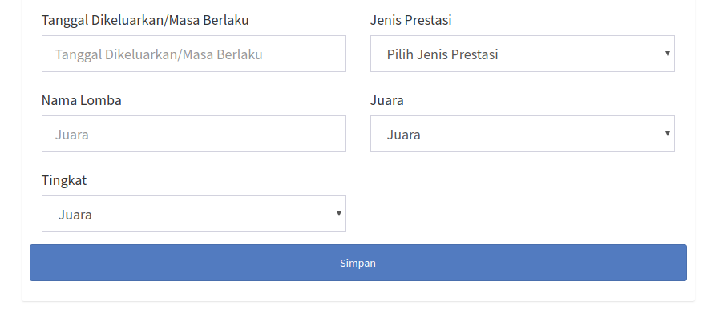](adminsekolah/psb-umum_menu-form-afirmasi3.png)

Berikut ini merupakan form jalur Afirmasi yang sudah terisi:

[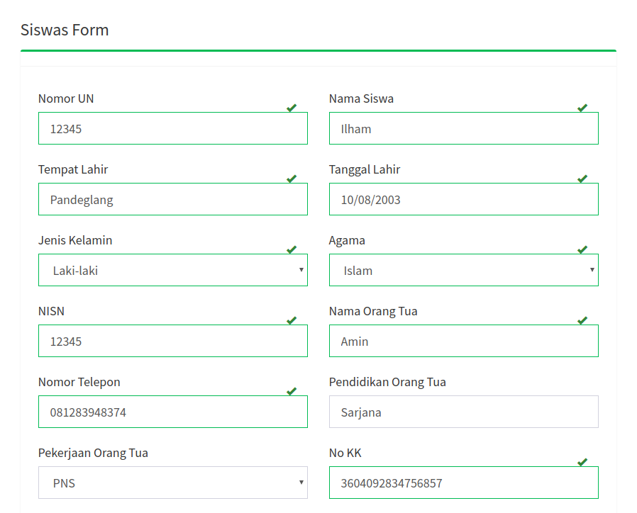](adminsekolah/psb-umum_menu-form-afirmasi-terisi.png)
[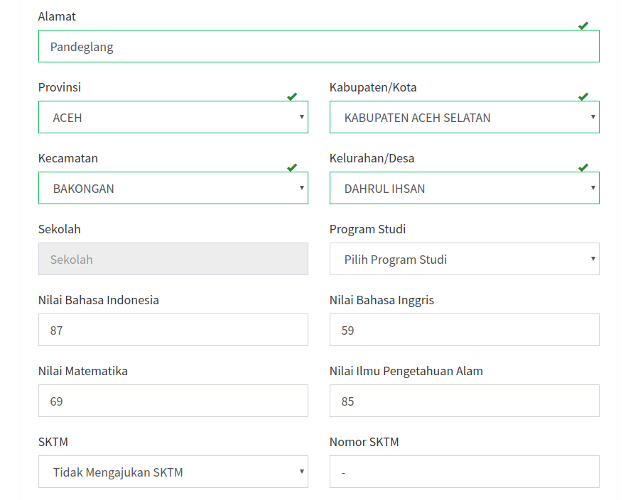](adminsekolah/psb-umum_menu-form-afirmasi-terisi2.png)

Jika pengisian sudah selesai maka data akan muncul pada tabel pendaftaran afirmasi:

[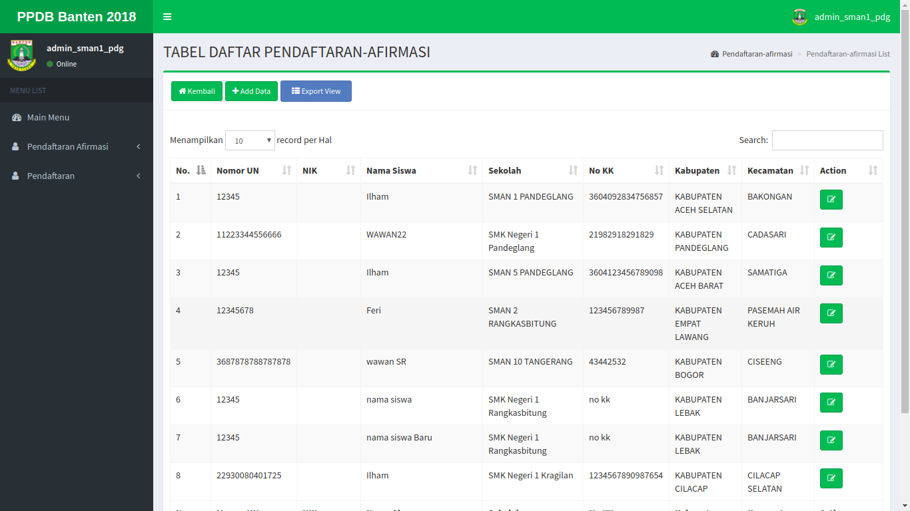](adminsekolah/psb-umum_menu-tabel-afirmasi.png)

### Pendaftaran Luar Zona

Pendaftaran jalur ini merupakan jalur khusus untuk siswa yang proses pendaftarannya dilakukan oleh admin sekolah. Jalur ini meliputi siswa yang memiliki kartu keluarga di Provinsi Banten tetapi datanya tidak terdapat di data Dapodik. 

Untuk siswa yang melakukan pendaftaran di jalur ini maka siswa tidak dapat melakukan pindah sekolah dan hanya dapat melakukan sekali pendaftaran.

Berikut ini merupakan form isian yang harus diisi oleh admin sekolah:

Berikut ini merupakan form jalur Luar Zona yang sudah terisi:

Jika pengisian sudah selesai maka data akan muncul pada tabel pendaftaran Luar Zona:

### Reset Password

Menu ini berfungsi untuk melakukan reset password bagi siswa yang lupa akan login passwordnya. Admin hanya bisa mereset password siswa yang mendaftar ke sekolah dimana admin bekerja (Jika siswa mendaftar ke **SMA Negeri 1 Pandeglang** maka hanya admin sekolah **SMA Negri 1 Pandeglang** yang bisa me-reset password siswa tersebut.

Di menu ini admin bisa merubah password siswa yang kemudian diberikan kepada siswa tersebut.

Berikut ini merupakan form isian yang harus diisi oleh admin sekolah:

Berikut ini merupakan form reset password yang sudah terisi:

Setelah siswa menerima password dari admin, maka siswa bisa login ke akunnya dan akan langsung terbuka form reset password di akun siswa tersebut (Untuk melakukan reset password siswa bisa di lihat di **Panduan Siswa**)
