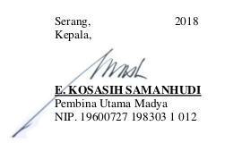
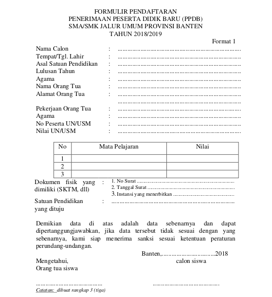
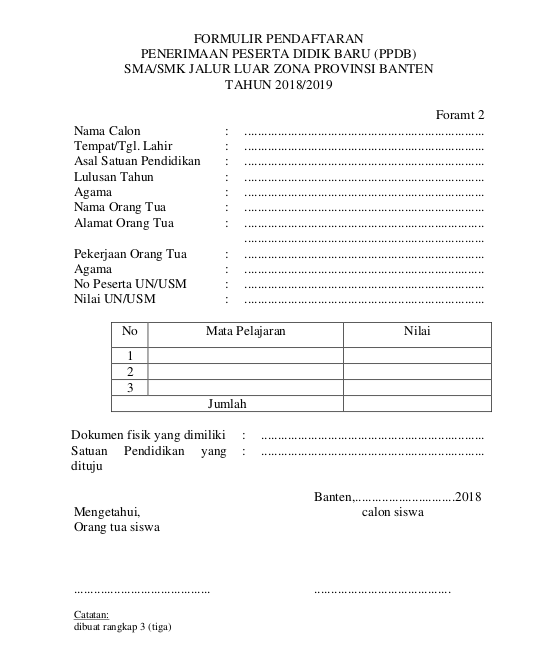
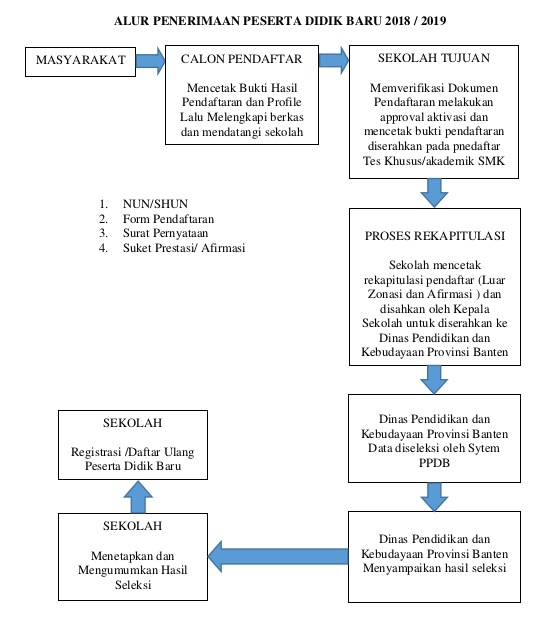

## PEDOMAN PENERIMAAN PESERTA DIDIK BARU (PPDB) PADA JENJANG PENDIDIKAN MENENGAH (SMA/SMK/SKH),PROVINSI BANTEN TAHUN PELAJARAN 2018/ 2019

### Umum

Pendidikan merupakan hak setiap warga negara yang harus dipenuhi pemerintah dan tidak memandang perbedaan suku, ras, agama maupun ekonomi. Pemerintah memiliki kewajiban untuk menyelenggarakan layanan pendidikan berkualitas dan menjangkau seluruh lapisan masyarakat yang ada. Makna penting dari pendidikan adalah sebagai media dalam mewujudkan keunggulan dan daya saing suatu bangsa melalui optimalisasi potensi yang dimiliki peserta didik agar dapat tumbuh dan berkembang secara optimal dan diharapkan di masa mendatang dapat berkontribusi secara nyata dalam pembangunan masyarakat suatu bangsa.

Dalam konteks pendidikan, peserta didik merupakan unsur utama yang dikembangkan potensinya sesuai dengan tujuan pendidikan nasional yakni mewujudkan manusia Indonesia seutuhnya. Menyadari pentingnya peserta didik sebagai modal pembangunan suatu bangsa (human capital) yang perlu dikembangkan potensinya secara optimal, maka perlu upaya strategis dari pemerintah khususnya melalui Dinas Pendidikan dan Kebudayaan Provinsi Banten untuk meningkatkan dan memperluas akses terhadap pendidikan yang memungkinkan masyarakat (peserta didik) memperoleh hak pendidikan dalam rangka mengembangkan kapasitas dan kemampuan yang dimiliki.

### Dasar Hukum

1. Peraturan Pemerintah No. 17 Tahun 2010 tentang Pengelolaan dan Penyelenggaraan Pendidikan;

2. Peraturan Pemerintah No. 13 Tahun 2015 tentang Perubahan Kedua atas Peraturan Pemerintah No. 19 Tahun 2005 tentang Standar Nasional Pendidikan;

3. Peraturan Bersama Mendiknas dan Menag No. 04/ VI/ PB/ 2011 dan MA/ 111/ 2011 tentang Penerimaan Peserta Didik Baru Sekolah dan Madrasah;

4. Peraturan Menteri Pendidikan dan Kebudayaan Nomor 20 Tahun 2016 tentang Standar Kompetensi Lulusan Pendidikan Dasar dan Menengah;

5. Peraturan Menteri Pendidikan dan Kebudayaan Nomor 21 Tahun 2016 tentang Standar Isi Pendidikan Dasar dan Menengah;

6. Peraturan Menteri Pendidikan dan Kebudayaan No. 22 Tahun 2016 tentang Standar Proses Pendidikan Dasar dan Menengah;

7. Peraturan Menteri Pendidikan dan Kebudayaan No. 23 Tahun  2016 tentang Satandar Penilaian Pendidikan Dasar dan Menengah; 

8. Peraturan Menteri Pendidikan dan Kebudayaan RI Nomor 17 Tahun 2017 tentang Penerimaan Peserta Didik Baru Pada Taman Kanak-kanak, Sekolah Dasar, Sekolah Menengah Pertama, Sekolah Menengah Atas, Sekolah Menengah Kejuruan, atau Bentuk Lain Yang Sederajat;

9. Peraturan Daerah Provinsi Banten No. 7 Tahun 2012 tentang Penyelenggaraan Pendidikan;

10. Peraturan Gubernur Banten Nomor 21 Tahun 2017 tentang Penerimaan Peserta Didik Baru Sekolah Menengah Atas Negeri, Sekolah Menengah Kejuruan Negeri dan Sekolah Khusus Negeri Tahun Pelajaran 2018/2019;

11. Surat Keputusan Direktorat Jenderal Pendidikan Dasar dan Menengah Nomor: 4678/D/KEP/MK/2016 Tanggal 2 September 2016 tentang Spektrum Keahlian Pendidikan Menengah Kejuruan.

### Maksud dan Tujuan

Tujuan disusunya pedoman Penerimaan Peserta Didik Baru pada jenjang pendidikan menengah (SMA/SMK/SKH) di Provinsi Banten adalah sebagai Pedoman bagi Dinas Pendidikan dan Kebudayaan, Penyelenggara, Satuan Pendidikan dan Masyarakat dalam Penerimaan Peserta Didik Baru.

Adapun tujuan disusunya Pedoman Penerimaan Peserta Didik Baru ini adalah :

1. Terciptanya ketertiban dalam penyelenggaraan PPDB yang sesuai dengan ketentuan dan peraturan yang berlaku;
2. Kegiatan PPDB dapat berjalan dengan objektif, transparan, akuntabel dan berkeadilan.

### Azaz Penerimaan

1. Objektif 
Penerimaan Peserta Didik Baru harus memenuhi ketentuan umum serta sesuai ketentuan peraturan perundang-undangan  yang berlaku.

2. Transparan
Pelaksanaan penerimaan Peserta Didik Baru bersifat terbuka dan dapat diketahui masyarakat, untuk menghindari penyimpangan yang mungkin terjadi.

3. Akuntabel
Proses penerimaan Peserta Didik Baru dapat dipertanggung jawabkan baik prosedur maupun hasilnya.

4. Berkeadilan
Penerimaan Peserta Didik Baru tidak membeda-bedakan ras, suku, agama, tingkat ekonomi, maupun keterbatasan lainya dan harus memenuhi ketentuan umum serta sesuai dengan perundang-undangan yang berlaku.

### Penyelenggara

Penyelenggara kegiatan penerimaan Peserta Didik Baru (PPDB) terdiri atas :

|||||
|---|---|---|---|
|a. | Penanggungjawab       |  : |   Kepala Dinas Pendidikan dan Kebudayaan Provinsi Banten    |  
|b. |  Ketua |  : | Sekretaris Dinas Pendidikan dan Kebudayaan Provinsi Banten  |
|c. | Wakil Ketua 1  | :  |  Kepala Bidang SMA Dinas Pendidikan dan Kebudayaan Provinsi Banten |
|d.   | Wakil Ketua 2  | :  | Kepala Bidang SMK Dinas Pendidikan dan Kebudayaan Provinsi Banten  |
|e.   |Kordinator PPDB SKH   | :  | Kepala Bidang Pendidikan Khusus Dinas Pendidikan dan Kebudayaan Provinsi Banten  |
|f.   | Kordinator Wilayah  | :  |  Kepala Cabang  Dinas Pendidikan dan Kebudayaan Provinsi Banten di masing-masing Kabupaten/Kota |
|g.   | Sekretaris 1  | :  | Kepala Balai Teknologi Informasi dan Komunikasi Pendidikan (BTIKP) Dinas Pendidikan dan Kebudayaan Provinsi Banten  |
| h.  | Sekretaris 2  | :  | Kepala Seksi Pemanfaatan BTKIP Dinas Pendidikan dan Kebudayaan Provinsi Banten  |
| i.  |Seksi Pengolah Data   | :  |Kasi Kurikulum dan Kasi Kesiswaan SMA, SMK, dan SKH Dinas Pendidikan dan Kebudayaan Provinsi Banten|
|  j. |Kesekretariatan   | :  |Kasi Evaluasi BTKIP Dinas Pendidikan dan Kebudayaan Provinsi Banten   |
|k.   |Tim Pengaduan   | :  |Pengawas Sekolah SMA, SMK dan SKH   |

### Persyaratan Calon Peserta Didik Baru

1. Persyaratan Umum
   * Calon Peserta Didik Baru  SMA/SMK/SKH adalah calon Peserta Didik Baru yang telah memenuhi syarat dan ketentuan.

   * Calon Peserta Didik  baru merupakan lulusan SMP/MTs/ sederajat tahun berjalan dan lulusan satu tahun sebelumnya, termasuk lulusan program Paket B tahun berjalan dan satu tahun sebelumnya sesuai ketentuan perundang-undangan.

2. Persyaratan Khusus
   * Memiliki SHUN SMP atau bentuk lain yang sederajat.

   * Memiliki Ijazah/STTB SMP atau bentuk lain yang sederajat.

   * Khusus calon peserta yang berasal dari luar negeri selain keterangan dari Direktur Jenderal yang menangani Bidang Pendidikan Dasar dan Menengah.

   * Berusia paling tinggi 21 (dua puluh satu) tahun pada awal tahun pelajaran 2018/2019.

   * SMK atau bentuk lain yang sederajat bidang keahlian/program keahlian/kompetensi keahlian tertentu dapat menetapkan tambahan persyaratan khusus  dalam penerimaan peserta didik baru kelas X (sepuluh).

   * Peserta Didik mencantumkan Nomor Kartu Keluarga sesuai Domisili.

   * Khusus calon peserta didik yang berasal dari keluarga tidak mampu melampirkan bukti SURAT KETERANGAN TIDAK MAMPU (SKTM) dan bentuk lain yang dikeluarkan oleh instansi yang berwenang.

   * Satuan Pendidikan SMK melakukan tes fisik yang mencakup: tes buta warna, tinggi badan, tidak bertato, tidak bertindik (dilampirkan surat keterangan dari dokter).

### Prosedur Penerimaan Peserta Didik Baru

1. Sekolah yang diselenggarakan oleh pemerintah daerah wajib menerima calon peserta didik yang berdomisili pada radius zonasi terdekat dari sekolah sebesar 90% (sembilan puluh pesen) dari total jumlah keseluruhan peserta didik yang diterima.

2. Domisili calon peserta didik  berdasarkan alamat pada kartu keluarga yang diterbitkan paling lambat 6 (enam) bulan sebelum pelaksanaan PPDB.

3. Radius zonasi terdekat ditetapkan oleh Dinas Pendidikan dan Kebudayaan Provinsi Banten berdasarkan usulan Cabang Dinas Pendidikan dan Kebudayaan Kabupaten/Kota.  Zonasi terdiri dari:

  * Kota Serang 1 (satu) zonasi
  * Kabupaten Serang 1 (satu) zonasi
  * Kabupaten Lebak 1 (satu) zonasi
  * Kabupaten Tangerang 1 (satu) zonasi
  * Kota Tangerang 1 (satu) zonasi
  * Kota Tangerang Selatan 1 (satu) zonasi
  * Kota Cilegon 1 (satu) zonasi

4. Radius zonasi sesuai dengan kondisi di daerah tersebut berdasarkan jumlah ketersediaan daya tampung berdasarkan ketentuan rombongan belajar masing-masing sekolah  dengan ketersediaan anak usia sekolah (SLTP/Sederajat) di daerah berikut:

  * Jalur prestasi yang berdomisili diluar radius zonasi terdekat  dari sekolah sebanyak  5%  (lima persen) dari total jumlah keseluruhan peserta didik yang diterima.

  * Jalur bagi calon peserta didik yang berdomisili diluar zonasi terdekat dari sekolah dengan alasan khusus meliputi perpindahan domisili orangtua/wali peserta didik atau terjadi bencana alam/sosial, sebanyak 5% (lima persen) dari total jumlah keseluruhan  peserta didik yang diterima.

### Seleksi dan Presentasi Penerimaan Peserta Didik Baru

1. Seleksi dilaksanakan dalam satu zonasi minimal 90% (sembilan Puluh Persen) dan diluar zonasi maksimal 10% (sepuluh persen) Khusus SMA.

2. Seleksi dibagi menjadi:
   * Jalur Umum:
     * Seleksi berdasarkan Nilai SHUN SMP atau bentuk lain yang sederajat dan nilai zonasi bagi SMA.
     * Seleksi berdasarkan Nilai SHUN SMP atau bentuk lain yang sederajat dan hasil tes khusus bagi SMK (tes fisik).

   * Jalur Prestasi:
      * Seleksi berdasarkan Nilai SHUN SMP atau bentuk lain yang sederajat dan Nilai Prestasi serta nilai zonasi bagi SMA.
      * Seleksi berdasarkan Nilai SHUN SMP atau bentuk lain yang sederajat dan Nilai Prestasi serta Hasil Tes khusus bagi SMK.

    Peserta bidang Akademik dan Non Akademik meliputi:
    * Prestasi bidang akademik terdiri dari bakat istimewa dalam lomba akademik.
    * Prestasi Non Akademik terdiri dari Prestasi dalam bidang olah raga atau seni dan budaya.
    * Bukti prestasi akademik dan Non Akademik dibuktikan dengan piagam penghargaan/sertifikat/ surat keterangan yang diakui sekolah minimal juara 3 tingkat kabupaten /kota.

   * Jalur Afirmasi Khusus SMK
     Yaitu penerimaan peserta didik baru bagi calon siswa yang bertempat tinggal dekat sekolah atau calon siswa yang memiliki MoU (siswa kerja sama):
     * Pelaksanaan seleksi Jalur Afirmasi dilaksanakan oleh satuan pendidikan SMK.
     * Satuan Pendidikan melaporkan hasil seleksi dengan menginput pada Sistem aplikasi PPDB.

   * Jalur Luar Zonasi Kuota 10% (sepuluh persen) khusus SMA
     * Jalur prestasi sebanyak 5%  (lima persen).
     * Jalur bagi calon peserta didik dengan alasan khusus meliputi perpindahan domisili orangtua/wali peserta didik atau terjadi bencana alam/sosial, sebanyak 5% (lima persen).
     * Pelaksanaan seleksi Luar zonasi dilaksanakan oleh satuan pendidikan SMA.
     * Satuan Pendidikan melaporkan hasil seleksi dengan menginput pada Sistem aplikasi PPDB.

   * Calon peserta didik berasal dari keluarga ekonomi tidak mampu akan mendapat tambahan point pada semua Jalur pendaftaran PPDB dengan melampirkan bukti Surat Keterangan Tidak Mampu (SKTM) atau bukti lainnya yang diterbitkan oleh pemerintah daerah.

   * Persyaratan Zonasi pada point “a.1) diverifikasi oleh Satuan Pendidikan SMA, Tes khusus  pada Point “a.2) dilaksanakan oleh satuan pendidikan SMK, point ” b dan e” verifikasi dan aktivasi dilaksanakan oleh satuan pendidikan SMA/SMK, point “c” Proses seleksi dilaksanakan oleh satuan pendidikan SMA/SMK.

   * Proses penetapan dan seleksi nilai bagi yang sudah diaktivasi dilaksanakan oleh Sistem aplikasi PPDB.

3. Calon peserta didik baru yang berasal dari daerah luar Provinsi Banten paling banyak 2,5% ( dua koma lima persen) dari keseluruhan daya tampung jika kuota masih tersisa. 

### Tata Cara Pendaftaran

1. Sekolah Menengah Atas (SMA)
   * Pendaftaran Melalui Web
     * Pendaftaran dapat dilakukan oleh calon siswa secara langsung melalui Web dan mencetak bukti pendaftaran atau datang langsung ke sekolah tujuan dengan membawa berkas dan persyaratan.
     * Bagi calon siswa yang telah mendaftar mandiri melalui Web membawa bukti pendaftaran dan membawa berkas persayaratan ke sekolah tujuan.
     * Sekolah tujuan memverifikasi, memvalidasi dan aktifasi berkas persyaratan.
     * Sekolah tujuan mencetak bukti aktivasi pendaftaran dan diserahkan kepada calon peserta.

   * Pendaftaran melalui sekolah tujuan
     * Calon siswa mendaftar ke sekolah tujuan.
     * Sekolah tujuan memfasilitasi calon peserta didik mendaftar melalui Web.
     * Sekolah tujuan memverifikasi berkas persyaratan calon peserta.
     * Sekolah tujuan mencetak bukti aktivasi pendaftaran dan diserahkan kepada calon peserta.

2. Sekolah Menengah Kejuruan (SMK)
   * Pendaftaran melalui Web
     * Pendaftaran dapat dilakukan oleh calon siswa secara langsung melalui Web dan mencetak bukti pendaftaran atau datang langsung ke sekolah tujuan dengan membawa berkas dan persyaratan.
     * Bagi calon siswa yang telah mendaftar mandiri melalui Web membawa bukti pendaftaran dan membawa berkas persyaratan ke sekolah tujuan.
     * Sekolah tujun memverifikasi dan memvalidasi berkas persyaratan calon peserta.
     * Sekolah tujuan melaksanakan tes khusus.
     * Sekolah tujuan mengumumkan hasil tes khusus di sekolah.
     * Sekolah tujuan mengaktivasi calon peserta yang lolos tes khusus pada Sistem aplikasi PPDB.
     * Sekolah tujuan mencetak bukti aktivasi pendaftaran dan diserahkan kepada calon peserta.
    
   * Pendaftaran di sekolah tujuan
     * Calon siswa mendaftar ke sekolah tujuan.
     * Sekolah tujuan memfasilitasi calon peserta didik mendaftar melalui Web.
     * Sekolah tujuan memverifikasi berkas persyaratan calon peserta.
     * Sekolah tujuan melaksanakan tes khusus.
     * Sekolah tujuan mengumumkan hasil tes khusus di sekolah.
     * Sekolah tujuan mengaktivasi calon peserta yang lolos tes khusus pada Sistem aplikasi PPDB.
     * Sekolah tujuan mencetak bukti aktivasi pendaftaran dan diserahkan kepada calon peserta.

### Seleksi Penerimaan

1. Seleksi calon peserta didik baru kelas x (sepuluh) SMA, SMK, atau bentuk lain yang sederajat mempertimbangkan kriteria dengan urutan prioritas sesuai daya tampung berdasarkan ketentuan rombongan belajar sebagai berikut:

 * Surat Keterangan Tidak Mampu atau bentuk lain yang dikeluarkan oleh instansi yang berwenang bagi calon siswa dari keluarga tidak mampu.
 * Jarak tempat tinggal ke sekolah sesuai dengan ketentuan zonasi.
 * SHUN SMP atau bentuk lain yang sederajat, dan
 * Prestasi di bidang akademik dan non akademik yang diakui sekolah.

2. Jarak tempat tinggal ke sekolah sesuai dengan ketentuan zonasi dikecualikan bagi calon peserta didik baru pada SMK atau bentuk lain yang sederajat.

3. Khusus calon peserta didik pada SMK atau bentuk lain yang sederajat, selain mengikuti seleksi, sekolah dapat melakukan seleksi bakat dan minat sesuai dengan bidang keahlian/program keahlian/kompetensi keahlian yang dipilihnya dengan menggunakan kriteria yang ditetapkan sekolah dan institusi pasangan/ asosiasi profesi.

4. Sekolah yang diselenggarakan oleh masyarakat, dapat melakukan seleksi tes bakat skolastik atau potensi akademik.

5. Sekolah Menengah Kejuruan (SMK)
   Seleksi SMK melalui jalur non akademik terdiri dari 2 (dua) jenis yaitu:

   * Berdasarkan atas prestasi/bakat istimewa dalam lomba akademik, olah raga atau seni dan budaya.
   * Afirmasi : yaitu penerimaan peserta didik baru bagi keluarga tidak mampu, calon siswa yang bertempat tinggal dekat sekolah atau calon siswa yang memiliki MoU (siswa kerja sama).
   * Seleksi pada huruf “a dan “b dilakukan oleh sekolah dengan mengacu kepada ketentuan yang berlaku.

### Kuota atau Daya Tampung Penerimaan Peserta Didik Baru

Ketentuan kuota atau daya tampung dalam penerimaan peserta didik baru adalah sebagai berikut:
 1. Kuota atau daya tampung sekolah ditentukan oleh kepala sekolah melalui rapat dewan guru dan komite sekolah dengan mempertimbangkan kesiapan ruang kelas, jumlah guru, peminatan dan struktur kurikulum, beban mengajar, serta ketersediaan sarana prasarana belajar.

 2. Sekolah mengajukkan usulan kuota atau daya tampung penerimaan peserta didik baru kepada Kepala Dinas Pendidikan dan Kebudayaan Provinsi Banten paling lambat 1 (satu) bulan sebelum proses pendaftaran. 

 3. Tidak dibenarkan sekolah menyelenggarakan pendidikan double shift.

 4. Jika Kuota tidak terpenuhi dalam pelaksanaan PPDB online, pendaftaran siswa baru dapat dilaksanakan di sekolah.

 5. Dinas Pendidikan dan Kebudayaan Provinsi Banten akan melakukan verifikasi dan menetapkan kuota dan daya tampung dalam sistem penerimaan peserta didik baru.

 6. Kuota dan daya tampung bagi calon peserta didik baru jalur apresiasi siswa berprestasi yang berasal dari luar daerah Provinsi Banten maksimal 50% (lima puluh persen) dari total kuota apresiasi siswa berprestasi pada setiap satuan pendidikan.

 7. Kuota dan daya tampung bagi calon peserta didik baru yang berasal dari daerah luar Provinsi Banten paling banyak 2,5% (dua koma lima persen) dari kuota atau daya tampung luar zonasi.

### Jumlah Peserta Didik Baru dan Rombongan Belajar

1. Jumlah Peserta Didik baru pada setiap rombongan belajar (rombel) dan jumlah rombongan belajar pada setiap sekolah ditentukan oleh Kepala Sekolah melalui rapat Dewan Guru dan Komite Sekolah dengan mempertimbangkan kesiapan ruang kelas, jumlah guru, beban mengajar guru, permintaan sesuai struktur kurikulum dan kajian teknis lainnya yang mengacu pada Standar Nasional Pendidikan (SNP) dan/atau ketentuan peraturan perundang-undangan yang berlaku.

2. Jumlah rombongan belajar kelas X (sepuluh) tahun pelajaran 2018/2019 maksimal 12 rombel untuk SMA dan 24 rombel untuk SMK.

3. Jumlah siswa per rombongan belajar (rombel) maksimal 36 siswa di semua kelas.

### Pilihan Sekolah

1. Calon Pesera Didik Baru SMA hanya diperbolehkan memilih 1 (satu) pilihan sekolah yang berada dalam satu zonasi.

2. Calon Peserta Didik Baru SMK hanya diperbolehkan memilih 1 (satu) sekolah dengan 1 (satu) kompetensi keahlian pada 1 (satu) bidang keahlian di satu SMK. 

3. Calon Peserta Didik Baru yang berkebutuhan khusus dapat diterima di sekolah Pendidikan Khusus.

### Verifikasi Data/Informasi

Verifikasi data/informasi dilakukan oleh Tim Verifikasi untuk menjamin kebenaran data/informasi calon Peserta Didik Baru sebelum proses aktivasi secara online.  Verifikasi lapangan akan dilakukan kepada calon Peserta Didik Baru dengan jalur non-akademik, baik yang melalui jalur prestasi maupun afirmasi.

### Pengumuman Hasil Seleksi

1. Hasil seleksi Penerimaan Peserta Didik Baru ditetapkan oleh sekolah atas dasar hasil seleksi sistem aplikasi PPDB tingkat Provinsi Banten.

2. Sekolah mengumumkan calon peserta Didik Baru yang diterima melalui display  sekolah masing-masing.

3. Tanggal pengumuman kelulusan jalur akademik maupun non-akademik ditetapkan oleh Dinas Pendidikan dan Kebudayaan Provinsi Banten.

4. Bagi sekolah negeri yang belum terpenuhi kuota dan daya tampung sekolah dapat melakukan seleksi ulang penerimaan calon peserta didik baru secara mandiri paling lama 5 (lima) hari setelah pengumuman seleksi dan melaporkan hasilnya kepada Kepala Dinas Pendidikan dan Kebudayaan Provinsi Banten.

### Penetapan Peserta Didik Baru yang Diterima

Kepala sekolah membuat surat keputusan tentang Peserta Didik Baru yang dinyatakan diterima, pada masing-masing sekolah berdasarkan data yang telah di verifikasi Dinas Pendidikan dan Kebudayaan Provinsi Banten.

### Daftar Ulang

Sekolah melakukan proses daftar ulang terhadap calon Peserta Didik Baru yang dinyatakan diterima, dengan ketentuan sebagai berikut:

1. Daftar ulang dilaksanakan pada tanggal 6 s.d 10 Juli 2018.

2. Selama pelaksanaan daftar ulang **dilarang memungut biaya dalam bentuk apapun**.

3. Bagi Peserta Didik Baru yang diterima tetapi tidak melaksanakan daftar ulang, maka dianggap mengundurkan diri.

4. Kekosongan akibat dari pengunduran diri calon peserta didik tidak dapat diisi sampai akhir semester ganjil.

5. Pembiayaan PPDB 2018/2019 dibebankan pada Anggarann Pendapatan Belanja Sekolah (APBS) dan Anggaran Pendapatan dan Belanja Daerah (APBD) Provinsi Banten.

### Awal Kegiatan Belajar Mengajar

Awal kegiatan belajar mengajar (KBM) dilaksanakan sesuai dengan kalender pendidikan yang ditetapkan Dinas Pendidikan dan Kebudayaan Provinsi Banten.

### Masa Pengenalan Lingkungan Sekolah (MPLS)

1. Kegiatan MPLS dilaksanakan maksimal 3 (tiga) hari pada awal tahun ajaran baru .

2. Dalam kegiatan MPLS dilarang adanya **pembebanan biaya kepada peserta didik**.

3. Dalam kegiatan MPLS tidak diperkenankan adanya kegiatan perploncoan.

4. Materi wajib dalam kegiatan MPLS adalah pendidikan karakter dan literasi.

5. Ketentuan lebih lanjut mengenai kegiatan Masa Pengenalan Lingkungan Sekolah (MPLS) diatur dalam Pedoman Pengenalan Lingkungan Sekolah pada Pendidikan Menengah (SMA/ SMK) yang disusun oleh sekolah.

### Pelanganggaran dan Sanksi

1. Pelanggaran dalam penerimaan Peserta Didik Baru dapat berupa :
   * Menerima/mendaftarkan calon Peserta Didik Baru dengan menggunakan dokumen yang tidak sesuai/ tidak benar sebagaimana dipersyaratkan.
   * Menyetujui untuk menerima dan mengentri data pendaftaran pilihan ke-2 yang tidak sesuai dengan wilayah tempat pendaftaran.
   * Mengentri data palsu (Surat Keterangan Tidak Mampu/ surat keterangan prestasi/mengubah data asli nilai UN dan nilai raport) ke dalam sistem saat pendaftaran.
   * Menerima pendaftaran pada waktu diluar yang telah ditetapkan.
   * Menerima calon Peserta Didik Baru melebihi kuota dan daya tampung yang telah ditetapkan.
   * Menerima sejumlah uang/gratifikasi dari orang tua calon Peserta Didik Baru/ pihak lain untuk penerimaan calon Peserta Didik Baru yang tidak memenuhi persyaratan/tidak lolos seleksi.
   * Melakukan pungutan biaya PPDB.

2. Sanksi terhadap pelanggaran yang terjadi disesuaikan dengan ketentuan peraturan perundang-undangan yang berlaku dengan mempertimbangkan jenis dan bentuk pelanggaran setelah diobservasi, konfirmasi, dan klarifikasi melalui prosedur pelaporan pengaduan pelanggaran dalam PPDB.

### Pengaduan Pelanggaran

Pelaporan/pengaduan pelanggaran pelaksanaan PPDB harus memenuhi kriteria sebagai berikut :

1. Pelapor memiliki identitas yang jelas.

2. Laporan pelanggaran harus objektif, transparan dan akuntabel dilengkapi dengan bentuk tulisan disertai bukti fisik kejadian pelanggaran.

3. Pelaporan/pengaduan disampaikan kepada Tim Penanganan Pelaporan/Pengaduan Masyarakat pada Tingkat Provinsi.

### Pindahan Peserta Didik Baru

1. Perpindahan Peserta Didik Baru antar sekolah dalam Kabupaten/Kota atau dari luar Kabupaten/Kota hanya boleh dilakukan apabila sekolah yang menjadi tujuan pindah terdapat kekurangan kuota dan daya tampung setelah pembagian raport pada semester pertama tahun pelajaran berjalan.

2. Proses perpindahan Peserta Didik Baru dilaksanakan sesuai ketentuan peraturan perundang-undangan yang berlaku.

3. Daftar nama Peserta Didik Baru pindahan yang ditetapkan Kepala Sekolah, diumumkan melalui papan pengumuman dan/atau website sekolah.

4. Perpindahan Peserta Didik Baru dari satu sekolah ke sekolah lain pada SMA/SMK tidak dipungut biaya, kecuali dalam bentuk sumbangan yang besarnya dan waktu penyerahan tidak ditentukan atau disesuaikan dengan keadaan ekonomi orang tua Peserta Didik Baru.

### Penutup

Pendidikan merupakan salah satu layanan dasar yang harus dipenuhi oleh pemerintah dan menjadi hak warga Negara dalam rangka pengembangan kapasitas dan kemampuan diri untuk dapat bersaing dengan individu lain di lingkungan masyarakat. Dalam konteks pembangunan manusia (human development), pendidikan memegang peran penting dalam mendorong kemandirian individu mengoptimalkan potensi diri sehingga perlu adanya perluasan akses pendidikan yang seluas-luasnya dan mampu menjangkau seluruh lapisan masyarakat yang ada sehingga perlu diatur dalam mekanisme yang jelas, khususnya dalam proses penerimaan Peserta Didik Baru.

Dengan disusunnya Pedoman ini, diharapkan dapat menjaring calon-calon Peserta Didik Baru yang berkualitas, menjangkau seluruh lapisan masyarakat sehingga dapat meningkatkan partisipasi masyarakat serta meningkatkan APK SMA/SMK Provinsi Banten.

### Lampiran

#### Lampiran 1 

PENSEKORAN KRITERIA PRESTASI

| NO   |      **KEJUARAAN PERORANGAN YANG DISELENGGRAKAN KEMENDIKBUD / KEMENAG**      |  SKOR |
|:----------:|:-------------:|:------:|
| 1 |  Juara Internasional                | 60 |
| 2 | Juara 1 Tingkat Nasional            | 55 |
| 3 | Juara 2 Tingkat Nasional            | 50 |
| 4 | Juara 3 Tingkat Nasional            | 45 |
| 5 | Juara 1 Tingkat Provinsi            | 50 |
| 6 | Juara 2 Tingkat Provinsi            | 45 |
| 7 | Juara 3 Tingkat Provinsi            | 40 |
| 8 | Juara Harapan Tingkat Provinsi      | 35 |
| 9 | Juara 1 Tingkat Kabupaten/Kota      | 30 |
| 10 | Juara 2 Tingkat Kabupaten/Kota     | 25 |
| 11 | Juara 3 Tingkat Kabupaten/Kota     | 20 |

| NO   |      **KEJUARAAN PERORANGAN YANG DI SELENGGARAKAN DI LUAR KEMENDIKBUD / KEMENAG**      |  SKOR |
|:----------:|:-------------:|:------:|
| 1 |  Juara Internasional                | 60 |
| 2 | Juara 1 Tingkat Nasional            | 55 |
| 3 | Juara 2 Tingkat Nasional            | 50 |
| 4 | Juara 3 Tingkat Nasional            | 45 |
| 5 | Juara 1 Tingkat Provinsi            | 50 |
| 6 | Juara 2 Tingkat Provinsi            | 45 |
| 7 | Juara 3 Tingkat Provinsi            | 40 |
| 8 | Juara Harapan Tingkat Provinsi      | 35 |
| 9 | Juara 1 Tingkat Kabupaten/Kota      | 30 |
| 10 | Juara 2 Tingkat Kabupaten/Kota     | 25 |
| 11 | Juara 3 Tingkat Kabupaten/Kota     | 20 |

| NO   |      **KEJUARAAN BEREGU YANG DISELENGGRAKAN KEMENDIKBUD / KEMENAG**      |  SKOR |
|:----------:|:-------------:|:------:|
| 1 |  Juara Internasional                | 50 |
| 2 | Juara 1 Tingkat Nasional            | 45 |
| 3 | Juara 2 Tingkat Nasional            | 40 |
| 4 | Juara 3 Tingkat Nasional            | 35 |
| 5 | Juara 1 Tingkat Provinsi            | 40 |
| 6 | Juara 2 Tingkat Provinsi            | 35 |
| 7 | Juara 3 Tingkat Provinsi            | 30 |
| 8 | Juara Harapan Tingkat Provinsi      | 25 |
| 9 | Juara 1 Tingkat Kabupaten/Kota      | 20 |
| 10 | Juara 2 Tingkat Kabupaten/Kota     | 15 |
| 11 | Juara 3 Tingkat Kabupaten/Kota     | 10 |

| NO   |      **KEJUARAAN BEREGU YANG DI SELENGGARAKAN DI LUAR KEMENDIKBUD / KEMENAG**      |  SKOR |
|:----------:|:-------------:|:------:|
| 1 |  Juara Internasional                | 50 |
| 2 | Juara 1 Tingkat Nasional            | 45 |
| 3 | Juara 2 Tingkat Nasional            | 40 |
| 4 | Juara 3 Tingkat Nasional            | 35 |
| 5 | Juara 1 Tingkat Provinsi            | 40 |
| 6 | Juara 2 Tingkat Provinsi            | 35 |
| 7 | Juara 3 Tingkat Provinsi            | 30 |
| 8 | Juara Harapan Tingkat Provinsi      | 25 |
| 9 | Juara 1 Tingkat Kabupaten/Kota      | 20 |
| 10 | Juara 2 Tingkat Kabupaten/Kota     | 15 |
| 11 | Juara 3 Tingkat Kabupaten/Kota     | 10 |

| NO   |      **PENGHARGAAN KETUA OSIS**      |  SKOR |
|:----------:|:-------------:|:------:|
| 1 |  Penghargaan bagi Ketua Osis                | 10 |

#### Lampiran 2

Kriteria Peserta Didik Baru Warga Tidak Mampu dan Kriteria Nilai Zonasi Terdekat Alamat Kartu Keluarga dengan Sekolah

KRITERIA PESERTA DIDIK BARU WARGA TIDAK MAMPU

| NO   |      **KRITERIA**      |  SKOR |
|:----------:|:-------------:|:------:|
| 1 |  Terdaftar dalam database warga tidak mampu Provinsi  Banten/Kabupaten/Kota pada tahun pelajaran                | 50 |
| 2 | Memiliki Surat Keterangan Tidak Mampu (SKM) / Kartu Pra Sejahtera (KPS) / KKS / KIP            | 50 |
| 3 | Memiliki Surat Keterangan Tidak Mampu            | 50 |

KRITERIA NILAI ZONASI TERDEKAT
ALAMAT KARTU KELUARGA DENGAN SEKOLAH

| NO   |      **KRITERIA**      |  SKOR |
|:----------:|:-------------:|:------:|
| 1 |  Satu Kelurahan dengan Sekolah                | 100 |
| 2 | Satu Kecamatan dengan Sekolah            | 50 |

#### Lampiran 3

Formulir Pendaftaran

#### Lampiran 4 

Alur Penerimaan Peserta Didik Baru Tahun Pelajaran 2018/2019

#### Lampiran 5

Jadwal Kegiatan PPDB 2018/2019

| NO   |      KEGIATAN      |  WAKTU PELAKSANAAN| KETERANGAN |
|:----------:|:-------------|:------:|:------:|
| 1 |  Pengusulan Daya Tampung                | 5-9 Maret 2018 | Soft+Hard|
| 2 | Sosialisasi dan Pengusulan zonasi PPDB  | 12-15 Maret 2018 |KCD, Pengawas, MKKS SMA/SMK|
| 3 | Penetapan zonasi dan Daya tampung PPDB  | 2 April 2018 |Dindikbud|
| 4 | Sosialisasi dan Workshop Operator PPDB SMA/SMK  | 16 April s.d 29 Mei 2018 |Sekolah|
| 5 | Pendaftaran dan verifikasi berkas PPDB SMA/SMK  | 21 - 27 Juni 2018 |Calon Siswa, Sekolah|
| 6 | Proses Aktivasi Pendaftaran On Line SMA/SMK  | 21 - 27 Juni 2018 |Sekolah|
| 7 | Proses Pindah pilihan Online  | 23 – 27 Juni 2018 |Calon Siswa|
| 8 | Pengolahan Data Seleksi oleh sistem PPDB SMA/SMK  | 28 – 30 Juni 2018 |Dindikbud|
| 9 | SK Penetapan dan pengumuman Peserta Didik Baru yang diterima bagi yang sudah memenuhi Kuota  | 2 Juli 2018 |Web PPDB/Dindikbud|
| 10 | SK Penetapan dan Pengumuman Penerimaan Peserta Didik Baru bagi yang belum memenuhi kuota  | 5 Juli 2018 |Sekolah|
| 11 | Daftar Ulang  | 6-10 Juli 2018 |Sekolah|
| 12 | Awal Tahun Pelajaran  | 16 Juli 2018 |Sekolah|

