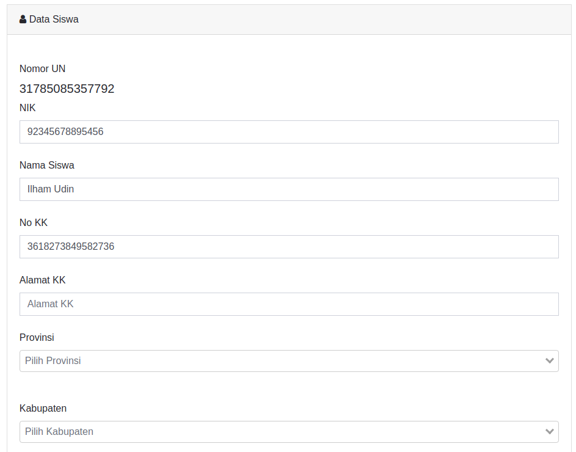
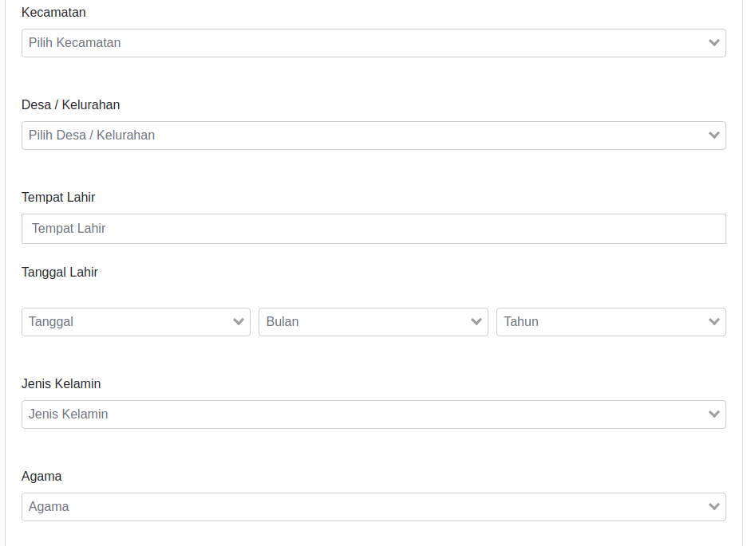
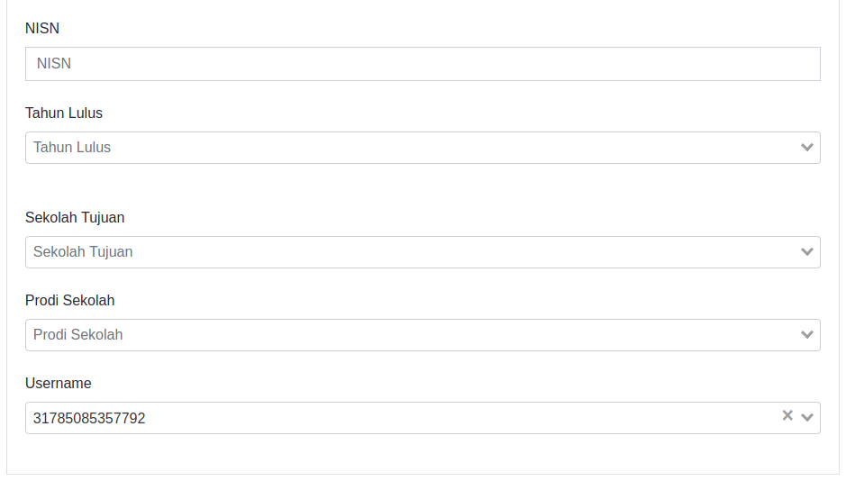
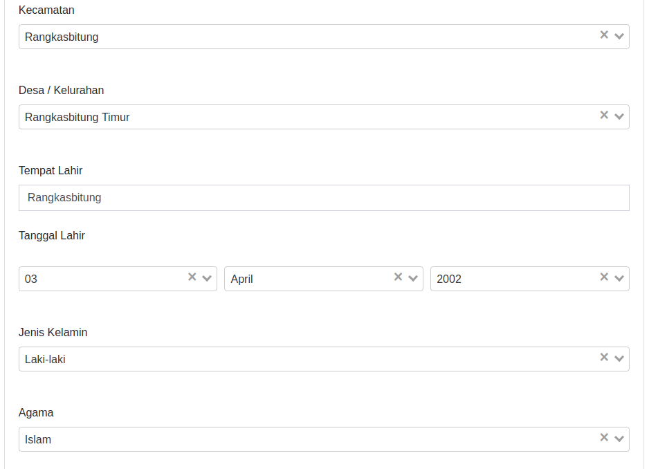
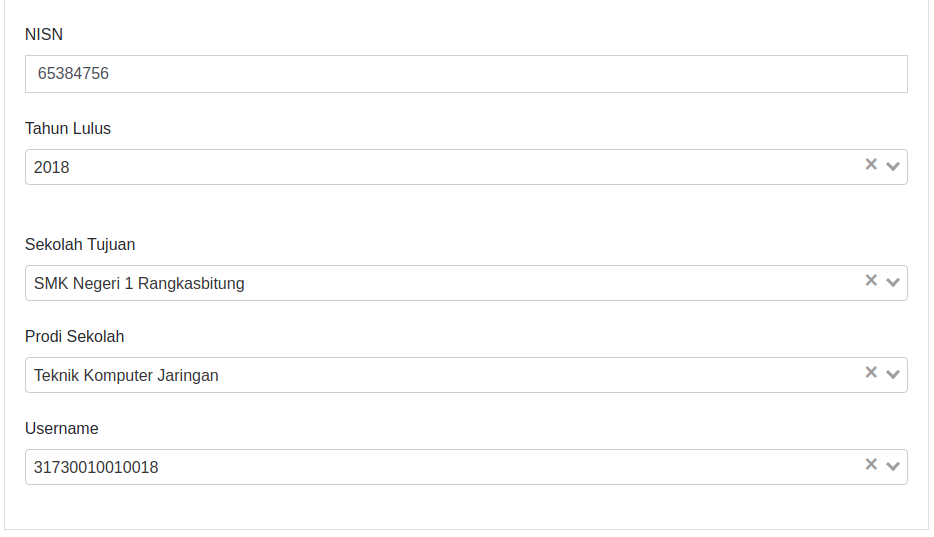
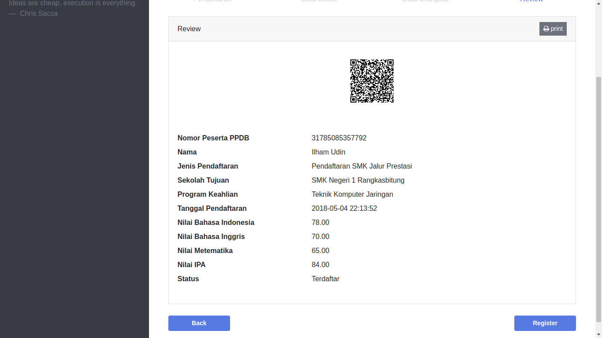
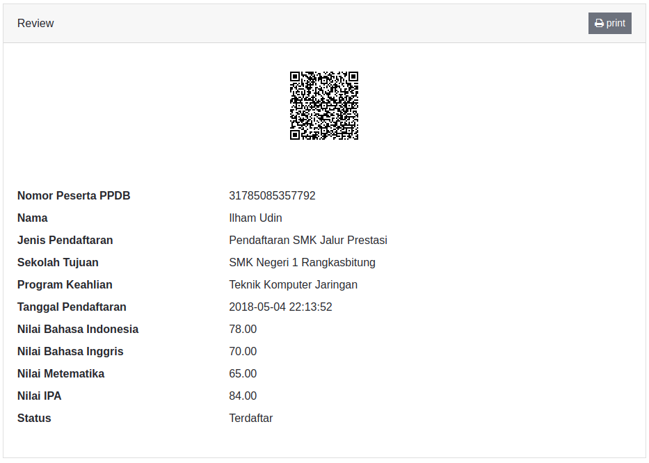

## Panduan Pendaftaran PPDB ONLINE 2018

### Halaman Depan Aplikasi

 

Disaat membuka aplikasi PSB untuk siswa maka akan muncul dua tombol, yaitu tombol **dashboard** dan tombol **daftar**. Disebelah kanan atas terdapat tombol **prinsip utama** dan **login** yang dapat digunakan jika sudah memiliki akun. Tombol prinsip utama akan mengarahkan ke layer asas PPDB dan juga informasi singkat mengenai PPDB.

Berikut ini adalah tampilan layer mengenai informasi singkat dan asas PPDB pada halaman utama:

 

 

### Tampilan Registrasi Siswa

Disaat menekan tombol **daftar** pada halaman utama, maka akan muncul menu registrasi. Registrasi dilakukan agar siswa mendapatkan akun untuk proses login pendaftaran. Setelah siswa berhasil melakukan proses registrasi, halaman browser akan langsung menampilkan menu pendaftaran dan juga siswa telah mendapatkan akun yang selanjutnya akan bisa digunakan untuk login.

 

Di form ini terdapat 5 **field** yang harus diisi oleh siswa agar mendapatkan akun. Filed yang harus diisi yaitu: Nomor UN, Nomor Kartu Keluarga, E-mail, Password, dan Konfirmasi Password. 

Berikut langkah-langkahnya:

1. Nomor UN: Pada field ini siswa harus mengisi Nomor UN yang dimiliki.

2. Nomor KK: Pada field ini nomor yang diisi harus merupakan kartu keluarga yang berdomisili di seluruh wilayah provinsi Banten. Jika memasukkan nomor kartu keluarga yang bukan berdomisili provinsi Banten maka pendaftaran tidak bisa dilakukan.   

3. E-mail: Pada field ini siswa tidak diwajibkan menginput alamat e-mail yang dimiliki dan hanya bersifat optional. 

4. Password: Pada field ini siswa harus mengisi password yang akan digunakan untuk login.

5. Konfirmasi Password: Pada field ini siswa harus mengisi ulang password yang telah diketikkan di field password.

Jika sudah diisi semua tekan tombol register dan akan langsung terbuka halaman pendaftaran.

### Tampilan Login Siswa

 

Untuk masuk ke halaman pendaftaran siswa di haruskan login dahulu menggunakan akun yang telah dimiliki sebelumnya. Jika siswa belum mempunyai akun maka siswa bisa melakukan registrasi dahulu di halaman registrasi.

 

Di form ini hanya terdapat 2 field yang harus diisi, yaitu Nomor UN dan password. Jika sudah diisi maka akan langsung tampil menu pendaftaran siswa.  

### Tampilan Menu Pendaftaran Siswa

 

Didalam halaman ini, siswa dapat melakukan pendaftaran ke sekolah yang akan ditujunya. Untuk melakukan proses pendaftaran siswa di haruskan mengisi form-form yang telah disediakan. Dan pada bagian kanan atas halaman terdapat menu profile yang dapat dilihat dan jika di klik akan mengarahkan ke menu profile siswa.

#### Form Pendaftaran

 

Pada form ini terdapat 3 field yang tersedia yaitu: Tanggal Pendaftaran, Kegiatan, dan Username.

Pada form ini field Tanggal Pendaftaran dan Username akan otomatis terisi, jadi siswa hanya mengisi field kegiatan saja. Field kegiatan diisi dengan memilih jalur pendaftaran yang dituju. Berikut contoh pilihan pada field kegiatan.

 

Contoh Jika form pendaftaran sudah diisi

 

Jika field yang dibutuhkan sudah diisi maka siswa bisa melanjutkan mengisi form selanjutnya dengan menekan tombol next.

 

#### Form Data Siswa

 

Di form ini siswa harus mengisi identitas lengkap dengan mengisi seluruh field yang tersedia. Pada form ini terdapat 19 field yang harus diisi yaitu: NIK, Nama Siswa, Nomor Kartu Keluarga, Alamat Kartu Keluarga, Tempat Lahir, Tanggal Lahir: Tanggal Bulan Tahun, Jenis Kelamin, Agama, NISN, Tahun Lulus, Sekolah Tujuan, Prodi Sekolah, Provinsi, Kabupaten, Kota, Desa, dan Username.

 
 
 

Pada form ini field Nama Siswa, No KK dan Username akan otomatis terisi, berikut langkah-langkahnya:

1. NIK: Pada field ini siswa harus mengisi nomor NIK yang dimiliki siswa.

2. Nama Siswa: Pada field ini nama siswa otomatis teriisi.

3. No KK: Pada field ini nomor kartu keluarga akan otomatis teriisi.

4. Alamat KK: Pada field ini siswa harus mengisi alamat sesuai dengan yang tertera pada kartu keluarga.

5. Tempat Lahir: Pada field ini siswa harus mengisi tempat lahir sesuai dengan yang tertera pada kartu keluarga.

6. Tanggal Lahir: Pada pengisian tanggal lahir terdapat tiga field yang harus diisi yaitu tanggal, bulan, dan tahun. Field ini diisi dengan cara memilih tanggal, bulan, dan tahun yang tersedia. 

 

 Berikut contoh pilihan field tanggal lahir:

 

 

 

7. Jenis Kelamin: Pada field ini siswa mengisi jenis kelamin dengan cara memilih jenis kelamin yang tersedia, berikut contoh pilihan field jenis kelamin:

 

8. Agama: Pada field ini siswa mengisi agama yang dianut dengan cara memilih agama yang tersedia, berikut contoh pilihan field agama:

 

9. NISN: Pada field ini siswa mengisi nomor NISN yang dimiliki.

10. Tahun Lulus: Pada field ini siswa mengisi tahun lulus sesuai dengan waktu kelulusan siswa, field ini diisi dengan cara memilih tahun kelulusan yang tersedia. Berikut contoh pilihan field tahun lulus:

 

11. Sekolah Tujuan: Pada field ini siswa mengisi sekolah yang nantinya akan dituju oleh siswa. Pada field ini terdapat list sekolah yang dapat dituju oleh siswa, list sekolah akan muncul sesuai dengan jalur pendaftaran yang dipilih siswa pada form pendaftaran. Jika pada form pendaftaran siswa memilih jalur SMA maka pada list hanya akan muncul sekolah SMA, begitu juga dengan SMK, jika pada form pendaftaran memilih jalur SMK maka hanya akan muncul sekolah SMK. Berikut ini merupakan contoh pilihan field sekolah:

 

12. Prodi Sekolah: Pada field ini siswa memilih prodi yang ditawarkan oleh sekolah, jika sekolah yang dipilih tidak memiliki prodi khusus maka pilihan ini tidak bisa dipilih. Berikut ini merupakan contoh pilihan field prodi sekolah:

 

13. Provinsi: Pada Field ini siswa memilih Provinsi dimana siswa tinggal. Berikut ini merupakan contoh pilihan field Provinsi:

 

14. Kabupaten: Pada field ini siswa memilih Kabupaten dimana siswa tinggal. Berikut ini merupakan contoh pilihan field Kabupaten:

 

15. Kota: Pada field ini siswa memilih Kota dimana siswa tinggal. Berikut ini merupakan contoh pilihan field Kota:

 

16. Desa: Pada field ini siswa memilih Desa dimana siswa tinggal. Berikut ini merupakan contoh pilihan field Desa: 

 

17. Username: Pada field ini akan terisi otomatis dengan Nomor UN siswa.

Berikut ini merupakan contoh form yang sudah selesai terisi:

 
 
 
 

Jika field yang dibutuhkan sudah diisi maka siswa bisa melanjutkan mengisi form selanjutnya dengan menekan tombol next.

 

#### Form Data Orang Tua

 

Di form ini siswa harus mengisi identitas orang tua dengan mengisi seluruh field yang tersedia. Pada form ini terdapat 9 field yang harus diisi yaitu: Nomor Telepon, Nama Ayah, Nama Ibu, Pendidikan Ayah, Pekerjaan Ayah, Pendidikan Ibu, Pekerjaan Ibu, Alamat Orang Tua dan Username.

 
 

Pada form ini field Username akan otomatis terisi, berikut langkah-langkahnya:

1. Nomor Telepon: Pada field ini siswa mengisi nomor telepon yang dimiliki oleh orang tua siswa.

2. Nama Ayah: Pada field ini siswa mengisi nama Ayah siswa sesuai yang tertera pada kartu keluarga.

3. Nama Ibu: Pada field ini siswa mengisi nama Ibu siswa sesuai dengan yang tertera pada kartu keluarga.

4. Pendidikan Ayah: Pada field ini siswa mengisi Pendidikan Ayah siswa sesuai dengan yang tertera pada kartu keluarga.

5. Pekerjaan Ayah: Pada field ini siswa mengisi Pekerjaan Ayah sesuai dengan yang tertera pada kartu keluarga.

6. Pendidikan Ibu: Pada field ini siswa mengisi Pendidikan Ibu siswa sesuai dengan yang tertera pada kartu keluarga.

7. Pekerjaan Ibu: Pada field ini siswa mengisi Pekerjaan Ibu siswa sesuai dengan yang tertera pada kartu keluarga.

8. Alamat Orang Tua: Pada field ini siswa mengisi alamat orang tua siswa sesuai dengan yang tertera pada kartu keluarga.

9. Username: Pada field ini akan terisi otomatis dengan Nomor UN siswa.

Berikut ini merupakan contoh form yang sudah selesai terisi:

 
 

Jika field yang dibutuhkan sudah diisi maka siswa bisa melanjutkan mengisi form selanjutnya dengan menekan tombol next.

 

#### Form Review

 

Di form ini terdapat informasi sesuai dengan apa yang telah diisi oleh siswa. Jika dirasa masih ada beberapa kesalahan maka siswa masih bisa mengeditnya dengan menekan tombol back yang tersedia pada bagian kiri bawah halaman atau juga dengan menekan menu form yang tersedia di bagian atas form dengan cara menekannya, siswa bisa memilih form mana yang kiranya masih terdapat kesalahan pengisian.

 

 

Jika semua data yang diisi sudah benar maka siswa harus menekan tombol register yang terdapat pada bagian kanan bawah di form review. 

  

Jika Registrasi sudah berhasil maka akan tampil pemberitahuan seperti berikut ini:

 

Berikut merupakan tampilan sesudah register:

 

Jika sudah di tekan maka tampilan review akan berubah dan Nilai UN siswa akan terlihat. 

 

Pada form ini akan tersedia juga barcode yang bisa di scan menggunakan aplikasi android. Siswa juga dapat melakukan print out form ini dengan cara menekan tombol print yang tersedia.

 

 

### Tampilan Menu Profile Siswa

Untuk mengakses menu ini siswa dapat menekan tombol profile yang terdapat pada bagian kanan atas halaman seperti berikut:

 

Pada menu ini siswa dapat melihat profile singkat siswa, seperti Nama, Nomor UN, E-mail, Nilai UN, Nilai Akademik, Nilai Prestasi, SKTM, dan juga Nilai Zona. Pada menu ini siswa bisa melakukan edit profile yang terbatas hanya pada alamat E-mail dan penggantian password.

 

Jika siswa ingin mengeditnya bisa dengan menekan tombol edit yang tersedia atau dengan menekan tombol profile dan memilih menu settings. Berikut merupakan contoh tampilan settings:

 

 