## Panduan Pendaftaran PPDB ONLINE 2018

### Halaman Depan Aplikasi

[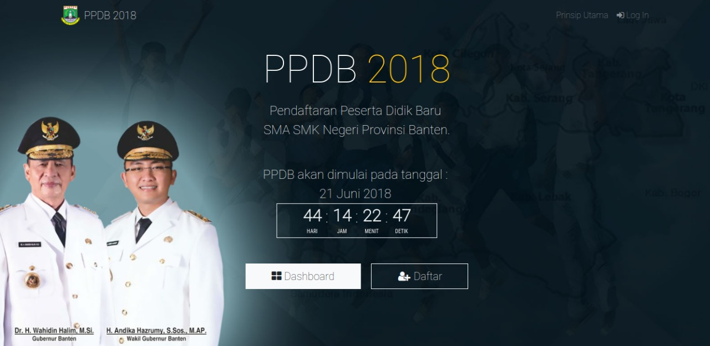](images/psb-umum_halaman-utama.png)

Disaat membuka aplikasi PSB untuk siswa maka akan muncul empat tombol, yaitu tombol **Pendaftaran**, tombol **Informasi & Bantuan**, tombol **Data Pendaftar**, dan tombol **Login**. 

Berikut ini adalah fungsi tombol yang ada pada halaman utama:

1. Tombol Pendaftaran: Tombol ini akan mengarahkan ke halaman registrasi siswa.
2. Informasi & Bantuan: Tombol ini akan mengarahkan ke halaman helpdesk Dindik.
3. Tombol Data Pendaftar: Tombol ini akan mengarahkan ke halaman Passing Grade.
4. Tombol Login: Tombol ini akan mengarahkan ke halaman login siswa.

### Tampilan Registrasi Siswa

[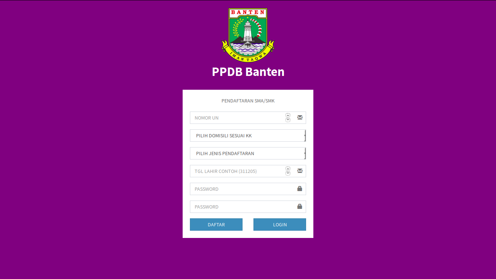](images/halaman-register-siswa.png)

Pada menu ini terdapat form registrasi yang harus diisi oleh siswa. Registrasi dilakukan agar siswa mendapatkan akun untuk proses login pendaftaran. Setelah siswa berhasil melakukan proses registrasi, halaman browser akan langsung menampilkan menu pendaftaran dan juga siswa telah mendapatkan akun yang selanjutnya akan bisa digunakan untuk login.

 [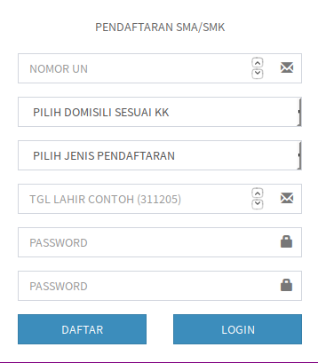](images/form-register-siswa.png)
 

Di form ini terdapat 7 **field** yang harus diisi oleh siswa agar mendapatkan akun. Filed yang harus diisi yaitu: Nomor UN, Domisili Siswa, Jenis Pendaftaran, Tanggal Lahir, Password, Konfirmasi Password, Captcha. 

Berikut langkah-langkahnya:

1. Nomor UN: Pada field ini siswa harus mengisi Nomor UN yang dimiliki.

2. Domisili Siswa: Pada field ini siswa harus mengisi domisili dimana siswa tinggal yang sesuai dengan Kartu Keluarga. Domisili ini nantinya menentukan pilihan sekolah yang akan dituju oleh siswa. Domisili terdiri dari Kabupaten/Kota yang terdapat di wilayah Provinsi Banten.

3. Jenis Pendaftaran: Pada field ini terdapat pilihan jalur pendaftaran yang akan dituju oleh siswa. Di field ini terdapat enam pilihan jalur pendaftaran yaitu:

 - Pendaftaran SMA Jalur Prestasi
 - Pendaftaran SMA Jalur Umum
 - Pendaftaran SMK Jalur Prestasi
 - Pendaftaran SMK Jalur Umum

4. Tanggal Lahir: Pada field ini siswa diharuskan mengisi tanggal lahir siswa sesuai yang tertera pada kartu keluarga. Format yang diisi yaitu: tanggal-bulan-tahun, contoh jika siswa lahir pada tanggal 01 Februari 2003 maka format yang harus diisi yaitu: **010203**.

5. Password: Pada field ini siswa harus mengisi password yang akan digunakan untuk login.

6. Konfirmasi Password: Pada field ini siswa harus mengisi ulang password yang telah diketikkan di field password.

7. Captcha: (Diisi dengan hasil dari angka penjumlahan yang tertera dilayar)

Jika sudah diisi semua tekan tombol daftar dan akan langsung terbuka halaman pendaftaran.

### Tampilan Login Siswa

Untuk masuk ke halaman pendaftaran siswa di haruskan login dahulu menggunakan akun yang telah dimiliki sebelumnya. Jika siswa belum mempunyai akun maka siswa bisa melakukan registrasi dahulu di halaman registrasi.

 [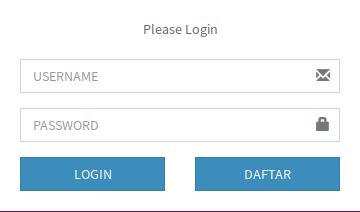](images/form-login-siswa.png)

Di form ini hanya terdapat 3 field yang harus diisi, yaitu Nomor UN, Password, dan Captcha (Diisi dengan hasil dari angka penjumlahan yang tertera dilayar). Jika sudah diisi maka akan langsung tampil menu pendaftaran siswa.  

### Tampilan Menu Dashboard Pendaftaran Siswa

 [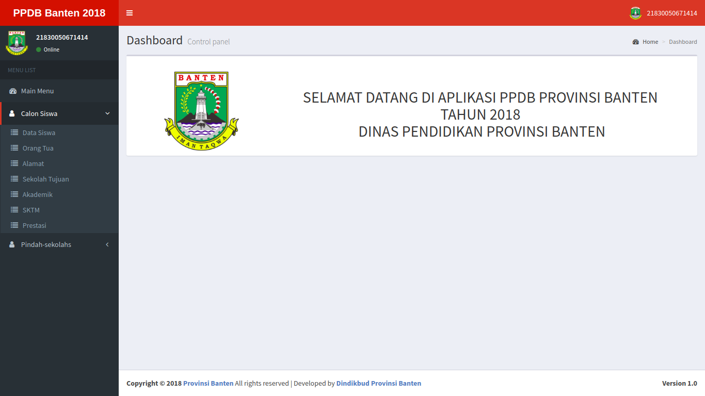](images/menu-pendaftaran.png)

Didalam halaman ini, siswa dapat melakukan pendaftaran ke sekolah yang akan ditujunya. Untuk melakukan proses pendaftaran siswa di haruskan mengisi form-form yang telah disediakan.

### Form Data Siswa

 

Di form ini siswa harus melengkapi identitas lengkap dengan mengisi field yang tersedia. Pada form ini terdapat 7 field yang tersedia yaitu: Nomor UN, Nama Siswa, Tempat Lahir, Tanggal Lahir, Jenis Kelamin, Agama, dan NISN.

Pada form ini field Nomor UN, Nama Siswa, Tempat Lahir, Tanggal Lahir dan NISN akan otomatis terisi, jadi siswa hanya mengisi field Jenis Kelamin dan Agama saja.

Berikut ini merupakan contoh form yang sudah selesai terisi:

 [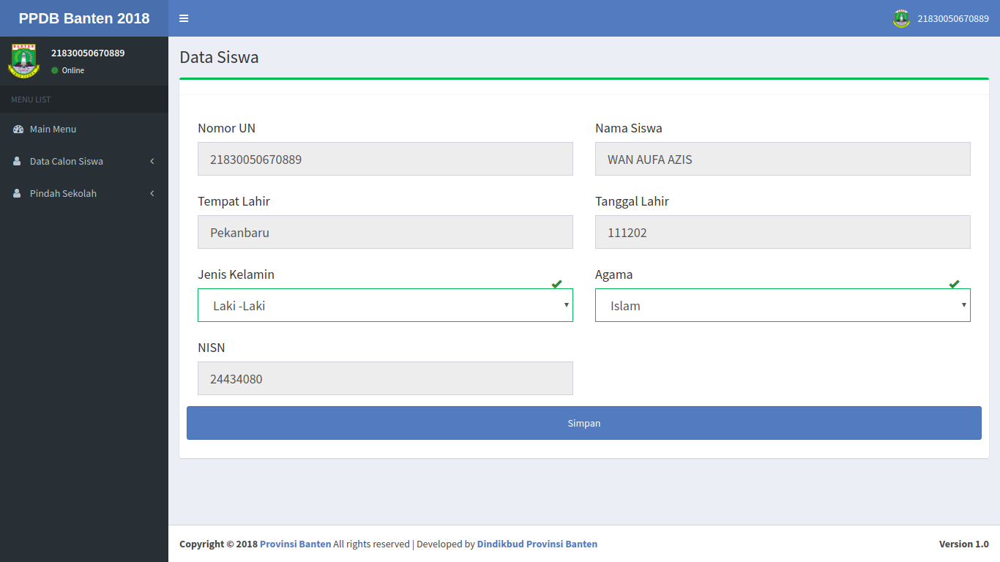](images/data-siswa-terisi1.png)
 
Jika field yang dibutuhkan sudah diisi maka siswa bisa melanjutkan mengisi form selanjutnya dengan menekan tombol simpan.

 

#### Form Data Orang Tua

[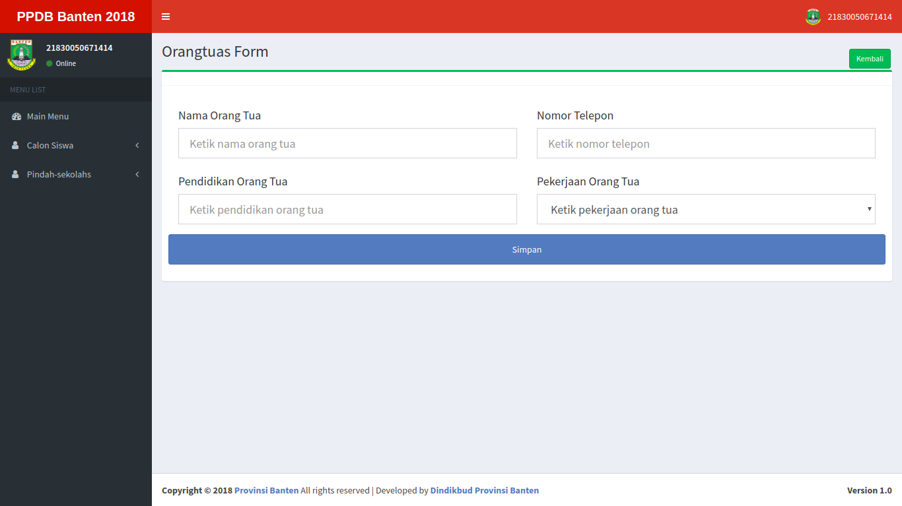](images/form-data-orang-tua.png)

Di form ini siswa harus mengisi identitas orang tua dengan mengisi seluruh field yang tersedia. Pada form ini terdapat 4 field yang harus diisi yaitu: Pendidikan Orang Tua Pekerjaan Ibu, Alamat Orang Tua dan Username.

Berikut langkah pengisiannya:

1. Nama Orang Tua: Pada field ini siswa mengisi nama orang tua siswa.

2. Nomor Telepon: Pada field ini siswa mengisi nomor telepon orang tua siswa yang bisa dihubungi.

3. Pendidikan Orang Tua: Pada field ini siswa mengisi pendidikan orang tua siswa.

4. Pekerjaan Orang Tua: Pada field ini siswa mengisi Pekerjaan orang tua siswa.

Berikut ini merupakan contoh form yang sudah selesai terisi:

 [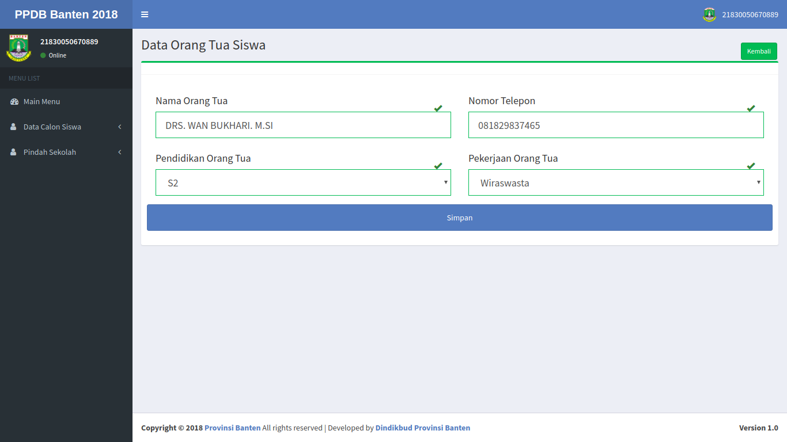](images/data-orang-tua-terisi1.png)
 
Jika field yang dibutuhkan sudah diisi maka siswa bisa melanjutkan mengisi form selanjutnya dengan menekan tombol simpan.

 

### Form Alamat

[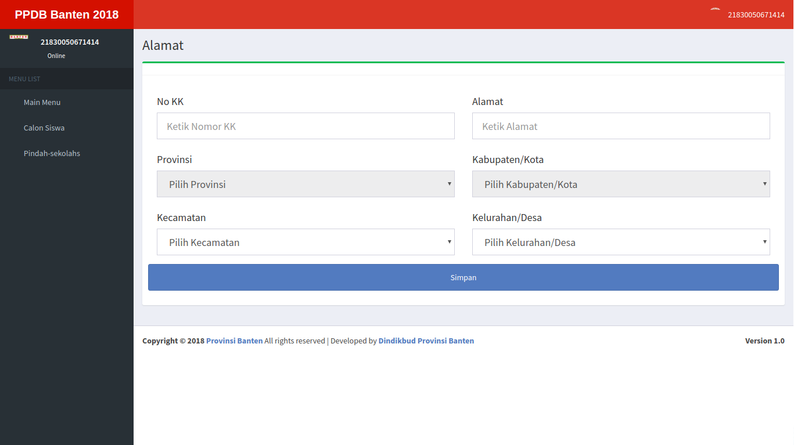](images/form-data-alamat.png)

Di form ini siswa harus mengisi alamat siswa yang sesuai dengan Kartu keluarga siswa. Pada form ini terdapat 6 field yang harus diisi yaitu: Nomor KK, Alamat, Provinsi, Kabupaten/Kota, Kecamatan, dan Kelurahan/Desa.

Berikut langkah pengisiannya:

1. Nomor KK: Pada field ini siswa mengisi nomor Kartu Keluarga siswa.

2. Alamat: Pada field ini siswa mengisi alamat siswa sesuai yang tertera di Kartu Keluarga.

3. Provinsi: Field ini akan terisi otomatis dengan Provinsi Banten.

4. Kabupaten/Kota: Field ini akan terisi otomatis sesuai pilihan siswa ketika melakukan registrasi.

5. Kecamatan: Pada field ini siswa mengisi kecamatan dimana siswa tinggal.

6. Kelurahan/Desa: Pada field ini siswa mengisi kelurahan/desa dimana siswa tinggal.

Berikut ini merupakan contoh form yang sudah selesai terisi:

 [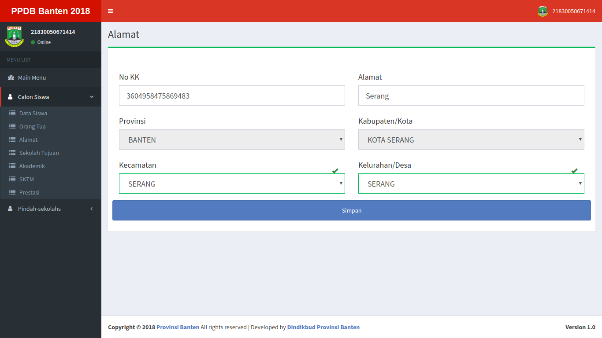](images/data-alamat-terisi1.png)
 
Jika field yang dibutuhkan sudah diisi maka siswa bisa melanjutkan mengisi form selanjutnya dengan menekan tombol simpan.

 

### Form Sekolah Tujuan

[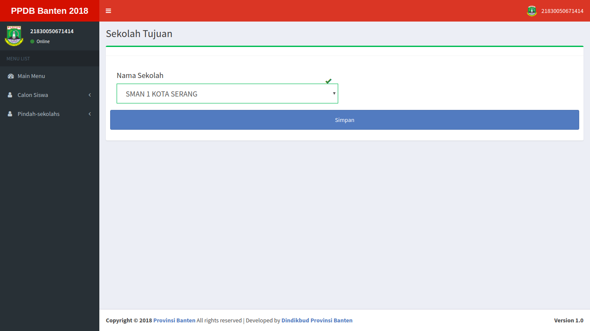](images/form-sekolah-tujuan.png)

Sekolah Tujuan: Pada field ini siswa mengisi sekolah yang nantinya akan dituju oleh siswa. Pada field ini terdapat list sekolah yang dapat dituju oleh siswa, list sekolah akan muncul sesuai dengan jalur pendaftaran yang dipilih siswa pada form pendaftaran. Jika pada form pendaftaran siswa memilih jalur SMA maka pada list hanya akan muncul sekolah SMA, begitu juga dengan SMK, jika pada form pendaftaran memilih jalur SMK maka hanya akan muncul sekolah SMK. Berikut ini merupakan contoh pilihan field sekolah:

Prodi Sekolah: Field ini hanya muncul untuk siswa yang memilih jalur pendaftaran SMK. Pada field ini siswa memilih prodi yang ditawarkan oleh sekolah, jika sekolah yang dipilih tidak memiliki prodi khusus maka field ini tidak akan muncul di dalam form. Berikut ini merupakan contoh pilihan field prodi sekolah:

 [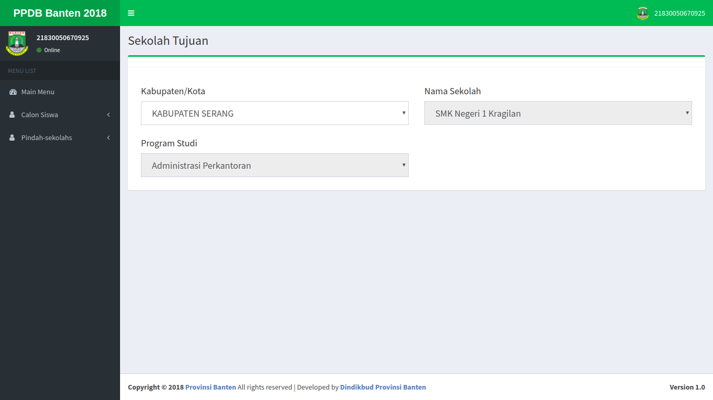](images/prodi-sekolah.png) 

### Form SKTM

[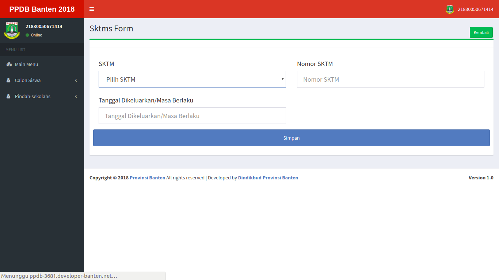](images/form-data-sktm.png)

Form ini hanya tersedia bagi siswa yang memilih pendaftaran jalur **Umum**. 

Di form ini siswa harus mengisi data SKTM yang dimiliki oleh siswa. Pada form ini terdapat 3 field yang harus diisi yaitu: SKTM, Nomor SKTM, dan Tanggal Dikeluarkan/Masa Berlaku.

Berikut langkah pengisiannya:

1. SKTM: Pada field ini siswa mengisi jenis SKTM yang dimiliki oleh siswa, jika siswa tidak memiliki SKTM maka siswa harus memilih **Tidak Mengajukan SKTM**.

2. Nomor SKTM: Pada field ini siswa mengisi nomor SKTM yang tertera di kartu SKTM Milik siswa, jika siswa tidak memilik SKTM maka diisi dengan "**-**".

3. Tanggal Dikeluarkan/Masa Berlaku: Pada field ini siswa mengisi tanggal dikeluarkannya SKTM dan juga masa berlakunya, jika siswa tidak memilik SKTM maka diisi dengan "**-**".

Berikut ini merupakan contoh form yang sudah selesai terisi:

 [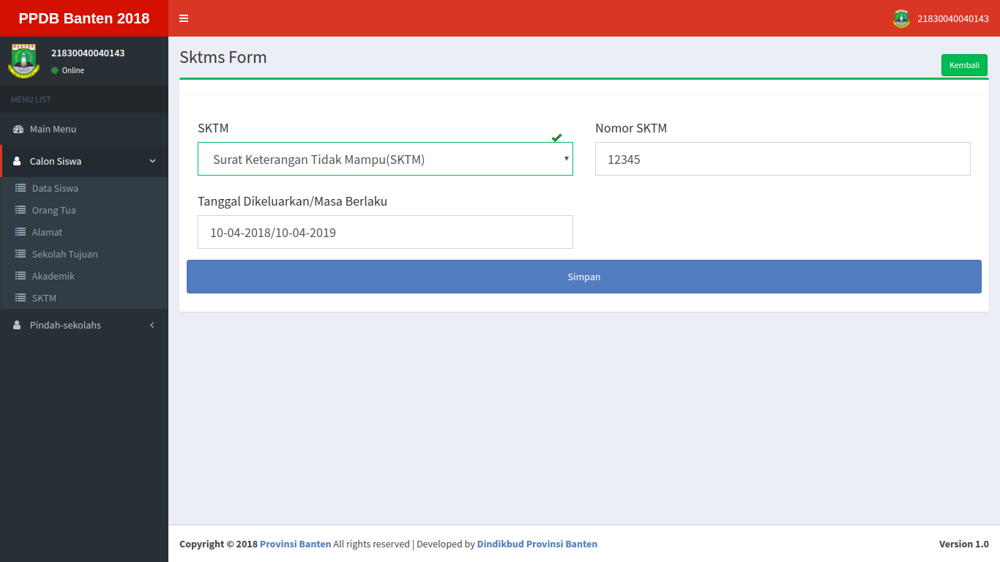](images/data-sktm-terisi1.png)
 
Jika field yang dibutuhkan sudah diisi maka siswa bisa melanjutkan mengisi form selanjutnya dengan menekan tombol simpan.

 

### Form Prestasi

[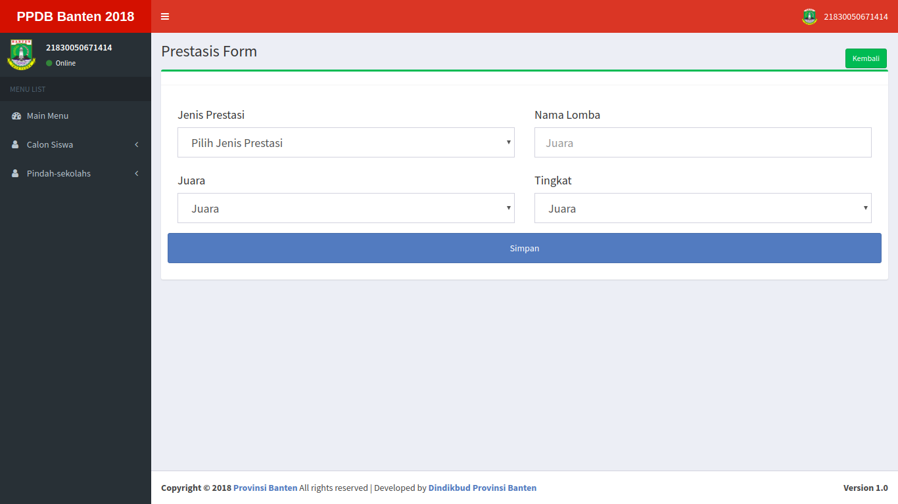](images/form-data-prestasi.png)

Form ini hanya tersedia bagi siswa yang memilih pendaftaran jalur **Prestasi**. 

Di form ini siswa harus mengisi keterangan prestasi yang dimiliki oleh siswa. Pada form ini terdapat 4 field yang harus diisi yaitu: Jenis Prestasi, Nama Lomba, Juara, dan Tingkat.

Berikut langkah pengisiannya:

1. Jenis Prestasi: Pada field ini siswa memilih jenis prestasi yang dimiliki oleh siswa.

2. Nama Lomba: Pada field ini siswa mengisi nama lomba yang diikuti oleh siswa.

3. Juara: Pada field ini siswa mengisi juara yang didapatkan pada perlombaan yang diikuti oleh siswa.

4. Tingkat: Pada field ini siswa mengisi tingkat perlombaan yang diikuti oleh siswa.

Berikut ini merupakan contoh form yang sudah selesai terisi:

 
 
Jika field yang dibutuhkan sudah diisi maka siswa bisa melanjutkan mengisi form selanjutnya dengan menekan tombol simpan.

 

### Form Cetak Formulir

Form ini akan otomatis terbuka jika semua isian pendaftaran telah selesai terisi. Pada menu ini siswa bisa mencetak formulir berdasarkan data yang telah diisi oleh siswa. Data ini bisa dijadikan bukti bahwa siswa telah melakukan pendaftaran online.

### Form Data Nilai UN

[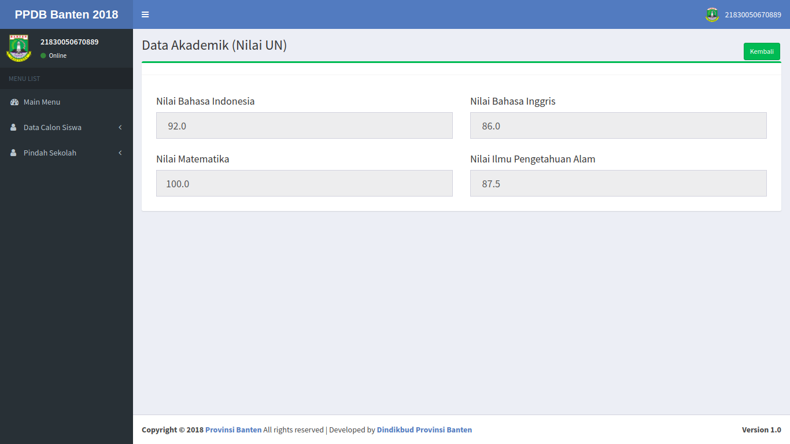](images/form-akademik.png)

Di form ini terdapat informasi mengenai hasil Nilai UN siswa. Siswa bisa melihat Nilai UN yang didapatkan oleh siswa.

### Tampilan Menu Pindah Sekolah

[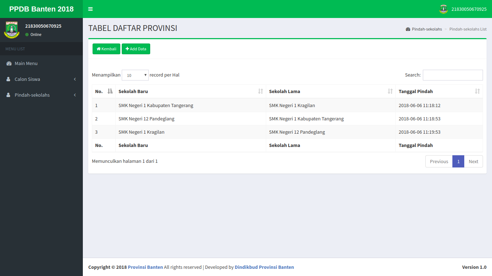](images/form-pindah-sekolah.png)

**Pindah Sekolah Merupakan** menu yang di sediakan didalam aplikasi PPDB Online agar siswa yang tidak lulus dalam passing grade pada sekolah tertentu dapat melakukan pindah ke sekolah lain. Siswa dapat melakukan perpindahan sekolah berulang kali sampai siswa mendapatkan kursi pada sekolah yang ingin ditujunya. Untuk mengakses menu ini siswa harus menunggu verifikasi pendaftaran dari admin sekolah. Ketika admin sekolah telah melakukan verifikasi pendaftaran maka siswa tidak dapat merubah seluruh data yang telah di buat siswa di dalam form pendaftaran. Untuk melakukan perpindahan sekolah berikut adalah langkah-langkahnya:

1. Tekan tombol **Add Data** pada form pindah sekolah
 
 

2. Lalu isi form pindah sekolah:

 - Kabupaten/Kota: Diisi dengan wilayah sekolah yang ingin dituju oleh siswa (Pilihan ini hanya untuk siswa yang memilih jalur pendaftaran SMK).

 - Nama Sekolah: Diisi dengan sekolah yang ingin di tuju.

 - Program Studi: Diisi dengan program studi yang diinginkan (Pilihan ini hanya untuk siswa yang memilih jalur pendaftaran SMK).

 - Jika pengisian sudah selesai maka tekan tombol **Simpan**.

Untuk siswa yang mendaftar ke jalur pendaftaran **SMK** maka siswa tersebut bisa melakukan pindah sekolah ke sekolah lainnya tetapi dengan program keahlian yang sama sesuai paket keahlian yang ada di sekolah tujuan yang baru. 

 [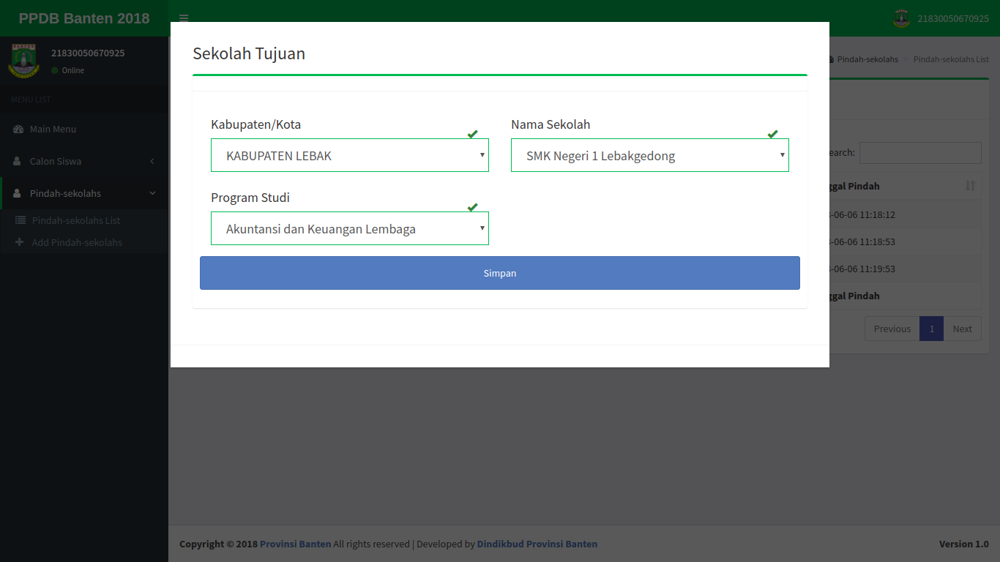](images/form-pindah-sekolah-terisi.png)

Berikut ini adalah hasil dari perpindahan sekolah yang telah dilakukan oleh siswa:

Sebelum melakukan perpindahan sekolah (Pada contoh ini sekolah terakhir yang dituju siswa adalah **SMK Negeri 1 Kragilan**):

Setelah melakukan perpindahan sekolah:

<!-- ## Passing Grade -->

### Tampilan Lupa Password
 
[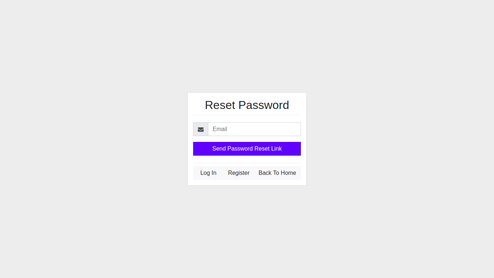](images/reset-password.png)

Menu lupa password adalah fasilitas yang disediakan untuk siswa ketika siswa lupa akan password yang dimilikinya. Untuk mengakses halaman ini, siswa harus menghubungi admin sekolah dimana siswa mendaftar. Jika sudah menghubungi admin sekolah, maka admin sekolah akan mereset password login siswa. Lalu siswa mengakses halaman login sesuai dengan **Nomor UN** yang dimiliki dan password yang telah diberikan oleh admin sekolah. Setelah login berhasil maka akan muncul form untuk merubah password yang baru. Berikut merupakan contoh form ganti password:

Di form ini siswa memasukkan password yang baru, yang nantinya bisa di pakai untuk login selanjutnya.

